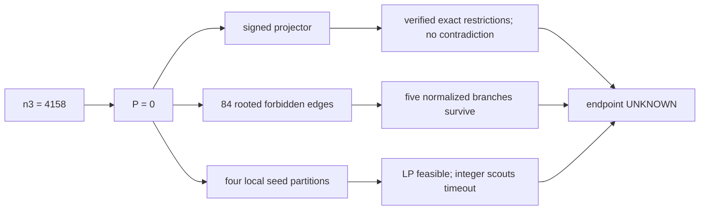

# Conway 99 Research

An open, reproducible research project on the existence of a strongly regular
graph with parameters `srg(99,14,1,2)`.

> **Research disclaimer:** This repository contains exploratory research and
> internally checked candidates, not peer-reviewed mathematical results.

## Frozen target

Determine whether there is a finite simple undirected graph on 99 vertices in
which every vertex has degree 14, every adjacent pair has exactly one common
neighbor, and every nonadjacent pair has exactly two common neighbors.

For a symmetric binary adjacency matrix `A` with zero diagonal, the target is
equivalently

```text
A^2 = 12 I - A + 2 J.
```

John H. Conway phrased the question as asking for a 99-vertex graph in which
every edge belongs to a unique triangle and every nonedge belongs to a unique
quadrilateral. See [CONJECTURE.md](CONJECTURE.md) for conventions, equivalences,
and the normalized search problem.

## Current status

- **Literature status:** no resolution found in the sources searched through
  2026-07-27; this is not a proof of openness.
- **Project status:** `EXPLORATORY`.
- **Resolution claim:** none.
- **Strongest internally verified conditional bound:** `n3>=708`, hence at
  least `209,994` induced six-cycles; this does not resolve existence.
- **Endpoint arithmetic:** at `n3=708`, the independently verified
  necessary arithmetic includes `tr(C^2)>=10` and `det(B)<=6525`. Wave 27
  conditionally excludes every full orthogonal ADE root-lattice form. Wave 28
  adds corrected discriminant/glue restrictions, a rootless bare-lattice
  control, and nonorthogonal two-neighbor controls. Wave 29 proves that the
  specific rootless control cannot supply the required 231-row
  projector/Schur origin. Wave 30 conditionally reduces every rootless,
  integrally orthogonally decomposable `h=729` endpoint form to one surviving
  `20+24` type and constructs an exact bare `T20 orthogonal_sum LAMBDA24`
  control of that rank/determinant shape. Wave 31 uses the actual
  vertex-triangle incidence projector to exclude every nontrivial rootless
  integral orthogonal decomposition, including that survivor and independently
  of `h=729`. Wave 32 independently verifies that every actual-incidence
  norm-two root has one signed Fano-complement support and triangle pattern
  `(+1)^21,0^189,(-1)^21`. It also proves that every surviving rootless
  actual-incidence endpoint is indecomposable and that rootlessness forbids
  the exact `{-2,-2,-1}` three-row motif. Wave 33 turns the rooted support
  into an exact `14+70+15` graph-extension criterion with a simple
  `2-(15,3,2)` design and a forced 70-vertex spectrum. On the rootless side,
  it exhibits a formal local null trade invisible to two precisely named
  contraction families and reduces every actual `R2` pair to an
  eight-vertex board with four transversal candidates. Neither lane closes
  its surviving branch. Wave 34 verifies an exact unrestricted rooted CNF,
  a projector reparameterization and necessary single-column reduction, and
  new rootless relation/moment bounds. The CNF is unsolved, the reduced
  columns are not compatible designs, and the rootless control is partial,
  so `n3=708` remains unexcluded. Wave 35 begins the complementary general
  upper-bound program at `n3=4158`. It independently verifies exact
  signed-projector and Smith-form consequences of that prism-free endpoint,
  derives an 84-unit rooted reduction with five surviving normalized
  branches, and records two exact local-incidence models. All bounded solver
  scouts stopped `UNKNOWN`; no endpoint was excluded and the rigorous
  interval remains `708<=n3<=4158`. Waves 36--38 add verified modular and
  block restrictions, exact 33-case proof bookkeeping, a complete
  all-prism encoding/oracle construction, and a universal 13-coclique
  consequence raising `rank_F7(M)` from at least 11 to at least 13. The
  two long-running heuristic scouts still expose no terminal result, proof
  coverage is `0/33`, and no upper bound below 4158 is claimed.
  Wave 39 independently raises the universal floor again to
  `rank_F7(M)>=19`, reducing the endpoint arithmetic rank-pair census from
  528 to 429. It also supplies an independently replayed VeriPB proof that
  closes `branch15 AND x187=1`, but the opposite shard remains open, so
  branch 15 and all 33 complete endpoint cases remain unresolved.
  Wave 40 independently reconstructs all eleven edge-local types together
  with the twelve vertices in the third triangle fibre and proves the
  stronger universal necessity `rank_F7(M)>=25`. This reduces the endpoint
  arithmetic census from 429 to 330 pairs; at `r3=12`, parity forces even
  `r7>=26`. A separate endpoint lane glues all edge types into a closed
  two-dimensional incidence complex, exhausts 4,050 normalized all-`222`
  one-triangle quotients, and reduces the full 39-vertex characteristic-seven
  rank to a cubic-core Laplacian rank. Its exact positive controls survive,
  so the endpoint and the upper bound remain unresolved.
  Wave 41 completes the full-matching equality analysis for every one of the
  eleven edge-local types and independently verifies the stronger universal
  necessity `rank_F7(M)>=26`. For the seven types containing an even part,
  164,928 boundary permutations reduce to 52 right kernels and 164,278 exact
  equality targets; all 540,540 grouped matching evaluations reject rank 25.
  A separate clean-room package verifies the four all-odd types. At the
  prism-free endpoint this removes `r7=25` and reduces the arithmetic census
  from 330 to 314 pairs. A second scoped theorem shows that if `r3=12` and
  every edge has type `222`, then parity forces `r7>=34`. Neither theorem
  excludes the endpoint, improves `n3<=4158`, or constructs a graph.
  Wave 42 independently classifies equality in the rank-26 boundary and
  proves the new universal necessity `rank_F7(M)>=27`. Seven even-part
  types are covered by 1,714,426,560 explicit labelled cases; a separate
  pivot/mate CSP covers 19,916,886,528,000 all-odd cases. The clean-room
  verifier found zero rank-26 survivors and agrees on every theorem count
  and all seven labelled permutation streams. At `n3=4158`, the arithmetic
  census falls from 314 to 297 pairs and `r3=12` forces even `r7>=28`.
  Separate scoped verifiers reduce one canonical all-`222` outside-incidence
  problem to 45,032 necessary six-sets and reproduce a new branch-15 prism
  clause family. Neither scoped reduction closes a branch. Endpoint coverage
  remains `0/33`, the interval remains `708<=n3<=4158`, and Conway-99 remains
  `UNKNOWN`. Wave 43 proves the conditional endpoint theorem
  `n3=4158 => rank_F7(M)>=28`, extends the exact three-way-matching reduction
  to all 264 canonical rank-33 lifts, and independently verifies that ordinary
  unrooted order-seven counts remain feasible. Wave 44 adds every aggregate
  vertex-, edge-, and nonedge-rooted order-seven equation and finds a second
  exact feasible integer witness. These results sharpen the boundary and rule
  out two coarse count strategies, but still do not exclude `n3=4158`;
  the general upper bound remains 4158. Wave 45 moves from linear count
  equations to exact positive-semidefinite rooted-flag moments. A clean-room
  verifier refutes both stored count witnesses and checks 17 successive
  separating cuts, but the immutable continuation ends `UNKNOWN` at timeout;
  no endpoint exclusion follows. Wave 46 independently verifies that the
  ordinary characteristic-seven row-code consequences and complete-enumerator
  moments admit generic controls in every rank 28 through 44, so that coding
  layer gives no endpoint obstruction. Wave 47 adds two independently checked
  alternative spaces: eight three-root moment families reject all 17 stored
  aggregate witnesses with 2,664 exact negative directions and 2,657 distinct
  cuts, while a degree-two polynomial-calculus replay finds 13 exact local XOR
  relations but no contradiction or forced variable. Wave 48 exposes the
  exact universal faces of the combined moment system but leaves numerical
  feasibility `UNKNOWN`. Wave 49 then constructs all 21 five-root/one-free
  moment families; clean-room comparison verifies all 2,520 root relabellings,
  42 controls, and 357 exact witness refutations. These are stronger finite
  relaxations, not an endpoint exclusion: `708<=n3<=4158` and Conway-99 remain
  `UNKNOWN`.
- **Symmetry policy:** no nontrivial automorphism, transitivity, Cayley, or
  circulant assumption is imposed on the full search.

A peer-reviewed 2025 paper calls existence an open problem. The latest
proof-separated freshness audit, through 2026-07-24, found no credible
construction or nonexistence proof. Current 2026 SAT work reports an
unsuccessful computation, and a June 2026 lecture notice discusses only a
possible similar approach. Those searches are evidence about the literature,
not a mathematical proof of openness or novelty.

A 2022 technical-report paper does state a nonexistence theorem, but two
independent project audits find that its decisive equation (88) assumes a false
uniform residual degree. Exact reconstruction gives residual-cut degrees
`1^20,2^51` and corrected count `122=2(71)-20`, rather than the asserted 142.
This refutes the displayed proof step, not the nonexistence statement itself;
both existence outcomes remain `UNKNOWN`.

Wave 3 added three advances, with independently checked structural and
proof-pipeline components, without changing the target status. First, cited
results force an induced six-vertex `N3` configuration in every putative graph;
a project derivation shows that each of its two central diagonal nonedges
2-percolates the whole graph. Second, exact mate-fiber coupling identities and
a conditional alpha-22 projector formulation sharpen the structural search.
Third, the native-cardinality model now has a source-built
Exact-to-VeriPB-to-CakePB certificate path. Its small positive and negative
controls pass. A 10-second full target log is itself verified to have
`NO CONCLUSION`, so it is explicitly non-evidentiary. See the
[Wave 3 audit](verification/2026-07-22-wave3-audit.md) and
[proof-pipeline calibration](verification/2026-07-22-veripb-calibration.md).

Wave 4 turns the derived universal `N3` consequence into a separately verified
target normalization: after safe global relabeling it is the single residual
unit `+24`. The unbranched `--n3` formula is equisatisfiable conditional on the
derived occurrence claim and assumes no completed-graph automorphism. Wave 4
deliberately rejected the legacy 11 representatives because their interaction
with the smaller stabilizer had not yet been proved. See the
[N3 audit](verification/2026-07-22-n3-normalization-audit.md).

Wave 5 supplies that missing joint analysis on the invariant shared fiber
`S_2`. The normalized stabilizer has order 768, and its action partitions the
945 compatible fiber matchings into exactly 12 verified orbits. A strict
standalone checker independently reconstructs the full stabilizer, cover,
Burnside checksum, representatives, and SAT literals. All 12 proof-producing
five-second scouts ended in checked `NO CONCLUSION`, so the target remains
`UNKNOWN`. See the
[joint-cover audit](verification/2026-07-22-n3-joint-cover-audit.md),
[certificate](verification/n3-joint-cover/n3-joint-cover.json), and
[clean-clone replay](verification/2026-07-22-wave5-clean-clone.md).

Wave 6 adds a verified 78-case second-stage refinement and a new conditional
structural bound. The oriented stabilizer has order 384 and partitions the
`945 * 11 = 10,395` matching/common-neighbor states into 78 exact orbits; its
standalone checker reproduces the parent and refined covers, literal mapping,
orbit-stabilizer data, and Burnside sum 29,952. Separately, an auxiliary graph
on the 693 graph edges gives the project derivation

```text
n3 >= 24,
induced_C6_count >= 209,310.
```

The bound uses the cited-and-derived theorem forcing an `N3` in the Conway
target and has passed an independent adversarial audit. Bounded runs on all
12 parent branches and an incremental scout of all 78 refined cases still
ended `UNKNOWN`; checked partial proof traces say only `NO CONCLUSION`. See the
[refined-cover audit](verification/2026-07-22-n3-refined-cover-audit.md),
[N3-count audit](verification/2026-07-22-n3-count-bound-audit.md), and
[Wave 6 clean replay](verification/2026-07-22-wave6-clean-clone.md).

Wave 7 strengthens the conditional structural bound by studying an auxiliary
graph on the 231 graph-triangles and its incidence with the support of the
Wave 6 graph `H`. Two independent exact enumerators exclude the extremal
values 24 and 27, giving

```text
n3 >= 30,
induced_C6_count >= 209,316.
```

The finite reduction, crossing multiplicities, and clean-source replay all
passed independent audits. This is a necessary condition, not a construction
or nonexistence proof; Conway-99 remains `UNKNOWN`. See the
[Wave 7 derivation](agents/2026-07-22-wave7-triangle-side-incidence.md),
[side-incidence audit](verification/2026-07-22-n3-side-incidence-audit.md),
[precise-status search](agents/2026-07-22-wave7-status-search.md), and
[clean replay](verification/2026-07-22-wave7-clean-clone.md).

Wave 8 excludes the remaining equality case `n3=30` without assuming a
completed-graph automorphism or classifying cubic graphs. A fixed-original-
vertex incidence identity and point-clique edge budget reduce the case to a
forbidden `H`-degree one, giving

```text
n3 >= 33,
induced_C6_count >= 209,319.
```

An adversarial proof reconstruction returned `PUBLISH`; a separate slow
standard-library audit generated all 21 cubic complement types and all
674,880 point-clique families, with zero surviving exact-two covers. Lou and
Murin's 2014 report is now explicitly credited for the upstream fixed-
triangle partner equations and `q!=1` gap; no novelty is claimed for those
facts. See the [Wave 8 derivation](agents/2026-07-22-wave8-n3-equality.md),
[equality audit](verification/2026-07-22-n3-equality-audit.md),
[status/prior-art audit](agents/2026-07-22-wave8-status-search.md), and
[clean replay](verification/2026-07-22-wave8-clean-clone.md). Conway-99 itself
remains `UNKNOWN`.

Wave 9 excludes the next equality case `n3=33`. The active-triangle arithmetic
has two profiles. A labeled crossing-graph lemma rules out active singleton
points and eliminates the mixed profile; in the all-`q=2` profile,
point-clique resources force either three saturated `K5` components or one
`K5` plus `K6` minus a perfect matching, and both alternatives contradict the
allowed `H`-degrees. This gives

```text
n3 >= 36,
induced_C6_count >= 209,322.
```

The overlap, actual-edge, disconnected, and residual-matching steps passed an
independent adversarial reconstruction. A compact standard-library checker
replays every finite case split. A separate two-implementation census rejects
all 610 admissible point-clique families across 266 quartic types, and a
detached no-local clone passes all tests and both census programs at the
frozen commits. See the
[Wave 9 derivation](agents/2026-07-22-wave9-n3-33-equality.md),
[equality audit](verification/2026-07-22-n3-33-equality-audit.md), and
[clean replay](verification/2026-07-22-wave9-clean-clone.md). A focused
[status search](agents/2026-07-22-wave9-status-search.md) found no checked
exact hit but explicitly leaves novelty `UNKNOWN`. The result is a conditional
necessary bound, not a resolution; Conway-99 remains `UNKNOWN`.

Wave 10 excludes `n3=36`. After singleton points eliminate both mixed active
profiles, the all-`q=2` complement `K` is 5-regular on twelve triangles. Local
crossing constraints leave point types `222`, `223`, `224`, and `233`. A
common-point rule, an open-twin obstruction in a cubic line graph, and exact
SRG common-neighbor saturation eliminate all points of sizes three and four.
The remaining size-two incidence forces `K=2K6`; each component then induces
the rook graph `L(K3,3)=srg(9,4,1,2)`, whose `lambda` and `mu` counts are
already saturated. This gives

```text
n3 >= 39,
induced_C6_count >= 209,325.
```

The first draft's unjustified closed-`K5` shortcut is retained and repaired in
the proof report. A compact checker covers every finite local step. Two
independent support enumerators recover the same 216 abstract survivors and
show that each violates rook saturation in eighteen places, leaving zero.
See the [Wave 10 derivation](agents/2026-07-22-wave10-n3-36-equality.md),
[equality audit](verification/2026-07-22-n3-36-equality-audit.md), and
[clean replay](verification/2026-07-22-wave10-clean-clone.md). The result is
again only a conditional necessary bound; Conway-99 remains `UNKNOWN`.

Wave 11 excludes `n3=39`. Singleton forcing removes the three mixed active
profiles, leaving thirteen active triangles, all with `q=2`, and a 6-regular
complement `K`. Point-hypergraph linearity and the common-point rule give an
expansion bound of four on every active point set. Exact singleton-side
crossing witnesses then eliminate sizes four and three; if every point has
size two, the total incidence 39 has impossible parity. Thus

```text
n3 >= 42,
induced_C6_count >= 209,328.
```

The first proof exposition failed audit because it did not explicitly carry
the premise `K=overline(L)` into the singleton-crossing step. The first compact
checker also hid a six-profile overlap and had weak semantic mutation tests.
Both failures and their repairs are public. Two independent implementations
now replay 8,907 premise-bound records with combined SHA-256
`452850018ad13362694f5bfff2e4beac03288a113a0391c3456a47cd6fbfe9a1`.
See the [Wave 11 derivation](agents/2026-07-22-wave11-n3-39-equality.md),
[adversarial audit](verification/2026-07-22-n3-39-equality-audit.md), and
[local replay audit](agents/2026-07-22-wave11-local-replay-audit.md). A
[clean-source replay](verification/2026-07-22-wave11-clean-clone.md) records
the initial LF/CRLF portability failure and the byte-stable repair. No
checked source was found for the exact exclusion, but novelty remains
`UNKNOWN`; the Conway-99 target itself also remains `UNKNOWN`.

Wave 12 excludes `n3=42`. Exact active-profile arithmetic leaves an all-`q=2`
case on fourteen triangles after a new degree-three point-clique obstruction.
Expansion and fixed-point arguments eliminate active points of sizes four and
three. In the remaining all-size-two case, the 21 point objects are the edges
of a cubic triangle-free graph `F` on fourteen labels. An independent GENREG
catalog plus a direct disconnected census matches all 112 types in the nauty
catalog; a mandatory-`K` filter leaves four, and independently generated and
replayed support-factor rejection trees leave zero.
Consequently,

```text
n3 >= 45,
induced_C6_count >= 209,331.
```

This remains a conditional necessary bound, not a Conway-99 resolution. The
official GENREG archive used for the cross-catalog audit has no stated
redistribution license, so it is fetched from its official URL and checked by
SHA-256 rather than committed. See the [Wave 12 proof reduction](agents/2026-07-22-wave12-n3-42-proof-a.md),
[support audit](verification/2026-07-22-n3-42-support-audit.md), and
[final integration audit](verification/2026-07-22-wave12-integration-audit.md).
No checked source was found for the exact exclusion; novelty and Conway-99 both
remain `UNKNOWN`.

Wave 13 conditionally excludes `n3=45`. Exact partitioning of
`sum q(T)=30` gives nine raw active profiles. The inherited degree and
point-clique obstructions leave a mixed order-fourteen profile and an
all-`q=2` order-fifteen profile. The mixed case is eliminated by its local
crossings and a cubic `K3,3`/open-twin obstruction. In the order-fifteen
case, flower arguments reduce every active point to size two or three; the
four possible size-three modes are then reduced to modes `122` and `222`.
Every vertex of the auxiliary graph `H` consequently has degree zero or four,
contradicting `|E(H)|=45` by the handshake lemma. Thus

```text
n3 >= 48,
induced_C6_count >= 209,334.
```

Two independent semantic verifiers reconstruct the human proof, including a
blind verdict frozen before comparison. The discovery SAT scan is not used in
that proof: its 17 negative rows remain `UNSAT_UNVERIFIED`. The first
computational bundle failed audit because its census and validator were not
self-sufficient; that failure remains public, followed by a separate repair
and fresh 17/17 formula, 31-mutation, and clause-by-clause audit. See the
[Wave 13 proof](agents/2026-07-22-wave13-n3-45-proof-a.md),
[first proof audit](verification/2026-07-22-wave13-n3-45-audit.md),
[blind proof audit](verification/2026-07-22-wave13-n3-45-audit-b.md), and
[computation-repair audit](verification/2026-07-22-wave13-computation-repair-audit.md).
This is a conditional necessary bound, not a Conway-99 resolution. No checked
source was found for the exact strengthening; novelty and the target remain
`UNKNOWN`.

Wave 14 analyzes the remaining equality frontier `n3=48` but does not exclude
it. Exact partitioning of `sum q(T)=32` gives twelve active profiles; inherited
degree and point-clique obstructions leave three. Human reductions eliminate
the mixed order-fourteen and order-fifteen profiles. The surviving case has
sixteen active triangles, `q=2` everywhere, a 9-regular complement `K`, and
active point sizes two or three. Eight aligned size-three modes remain, every
edge-auxiliary `H`-degree is zero or four, and a support graph `R` has degree
equal to point size with exact twofold rectangle coverage of `L`.

Those conditions are a sharp residual, not a contradiction. A checked
all-size-two object satisfies the stated active/local/support relaxation, and
a separate active-local SAT lane retains the exact raw status split
`1 SAT_CANDIDATE / 7 UNSAT_UNVERIFIED / 1 BUDGET_UNKNOWN / 2 TIMEOUT_UNKNOWN`.
The negative solver rows have no checked proof traces and are not evidence.
See the [Wave 14 reduction](agents/2026-07-22-wave14-n3-48-proof-a.md),
[proof audit](verification/2026-07-22-wave14-n3-48-proof-audit.md),
[computation audit](verification/2026-07-22-wave14-n3-48-computation-audit.md),
and [status audit](verification/2026-07-22-wave14-status-audit.md). The strongest
verified project bound therefore remains `n3>=48` and
`induced_C6_count>=209334`; exclusion of equality, Conway-99, and novelty are
all `UNKNOWN` at this checkpoint.

Wave 15 closes that residual by bringing back a global SRG constraint. Let
`X` be the original vertices whose active point `S_u` is nonempty. The Wave 14
incidence count gives `|X|<=24`. A point of size `s` supplies `2s` distinct
active-triangle neighbors inside `X`. Size-three points therefore already
have six; a size-two point has four such neighbors plus two distinct support
neighbors that cannot meet it in an active triangle. Hence
`delta(G[X])>=6`.

For every `m`-vertex induced subgraph of an `srg(99,14,1,2)`, the largest
nontrivial eigenvalue gives

```text
2e(X) <= 3m + m^2/9.
```

Minimum degree six would require `2e(X)>=6m`, forcing `m>=27`, contrary to
`m<=24`. An independent outside-common-neighbor second-moment calculation
gives the same contradiction. Two discovery lanes reached the obstruction
independently, and two adversarial verifiers reconstructed the delicate
point-to-original-vertex and meeting/support bridges. Therefore

```text
n3 >= 51,
induced_C6_count >= 209,337.
```

See the [global-lift proof](agents/2026-07-23-wave15-global-lift.md),
[global-lift audit](verification/2026-07-23-wave15-global-lift-audit.md),
[independent algebraic proof](agents/2026-07-23-wave15-algebraic.md), and
[algebraic audit](verification/2026-07-23-wave15-algebraic-audit.md). The
initial global certificate had a Windows CRLF/public-LF hash mismatch; failed
baseline `522260a` and repair `874af27` preserve that provenance. The Wave 14
active relaxation object remains valid in its narrow scope, while every lift
of the audited residual to a full target graph is excluded. This is still a
conditional necessary bound, not a resolution: Conway-99 and novelty remain
`UNKNOWN`.

Wave 16 excludes the next equality `n3=51` without assuming the Wave 14
point-size classification. Exact `sum q=34` partitioning and the audited
`d_K>=4` obstruction leave four profiles with `14<=r<=17` and only
`q=2,3`. If `X={u:S_u is nonempty}`, indexed incidence gives

```text
|X| <= floor(3r/2) <= 25.
```

A point of size at least three has six distinct active-triangle neighbors.
At a size-two point, the two-sided crossing law makes every meeting crossing
zero and every positive disjoint crossing a four-edge `K_(2,2)`. The fixed
sum `2(q(i)+q(j))` therefore supplies two positive nonmeeting neighbors for
type `(2,2)`, excludes mixed type `(2,3)`, and supplies three for `(3,3)`.
Thus every vertex of `G[X]` has at least six neighbors in `X`.

The same exact spectral bound used in Wave 15 requires `|X|>=27`, a
contradiction. Since `3|n3`, the new internally verified necessary bounds are

```text
n3 >= 54,
induced_C6_count >= 209,340.
```

The [structural proof](agents/2026-07-23-wave16-n3-51-structural.md) and
[independent audit](verification/2026-07-23-wave16-n3-51-structural-audit.md)
explicitly rule out hidden point-size, global `H`-degree, and support-graph
assumptions. The separate [computational audit](verification/2026-07-23-wave16-n3-51-computation-audit.md)
rebuilds seven active-local CNFs and one positive relaxation candidate, but
its `1 UNSAT_UNVERIFIED`, `5 TIMEOUT_UNKNOWN`, and historical
`1 BUDGET_UNKNOWN` are not evidence for the proof. Baseline `09c20e6` and
repair `7530cae` preserve a transient Wave 15 input-hash failure and its
public-provenance correction. Conway-99 and novelty remain `UNKNOWN`.

The [Wave 16 status search](agents/2026-07-23-wave16-status-search.md) and
[independent status audit](verification/2026-07-23-wave16-status-audit.md)
checked exact numbers, alternate terminology, recent citations, corrections,
maintained tables, current preprints, and the June 2026 Shpectorov lecture
notice. They independently recover the published identity
`induced_C6_count=209286+n3` and find no source for `n3>=54` or `209340`.
That nonhit is not a novelty certificate: the target and novelty both remain
`UNKNOWN`.

Wave 17 excludes the sharp equality `n3=54`. Exact `sum q=36` profile
filtering first removes every profile with at most 17 active labels. Equality
forces 18 active labels, 27 active original vertices, and a 6-regular induced
subgraph giving the equitable partition

```text
[[6,8],
 [3,11]].
```

The 27 active vertices become the edges of a simple cubic triangle-free graph
`F` on 18 labels. Their two remaining neighbors form a 2-factor `R` on
`E(F)`, with exact rectangle identity

```text
N A_R N^T = 2 A_L.
```

An independently audited parity argument excludes `F=3K3,3`. The remaining
finite universe is 455 connected order-18 cubic graphs of girth at least five
and two graphs `K3,3` plus a connected order-12 component, using the official
House of Graphs catalogs. For the 455 connected cases, a binary parity kernel
is trivial in 443 cases; all vectors in the other 12 kernels are exhaustively
checked, with none giving point-degree two. In the two mixed cases, degree
counting forces nine internal order-12 support edges although only one or zero
compatible candidates exist. A separately written verifier reconstructed all
457 cases, fetched and hash-validated the official catalog bytes, and passed
17 hostile tests. The earlier 457 raw SAT `UNSAT` statuses have no proof
traces and are not used.

Consequently the internally verified conditional necessary bounds are

```text
n3 >= 57,
induced_C6_count >= 209,343.
```

See the [structural reduction](agents/2026-07-23-wave17-n3-54-structural.md),
[structural audit](verification/2026-07-23-wave17-n3-54-structural-audit.md),
[exact census](agents/2026-07-23-wave17-n3-54-census.md),
[independent census audit](verification/2026-07-23-wave17-n3-54-census-audit.md),
[status search](agents/2026-07-23-wave17-status-search.md), and
[status audit](verification/2026-07-23-wave17-status-audit.md). Catalog
completeness and one representative per isomorphism class remain official
external premises; no local generator proof is claimed. Current sources still
describe Conway-99 as unresolved, and exact prior-art searches found no
`n3>=57`, `n3=54` exclusion, or `209343` threshold. Those nonhits do not
establish novelty. Conway-99 and novelty remain `UNKNOWN`.

Wave 18 independently excludes the next equality `n3=57`, without importing
the Wave 17 census. The exact `sum q=38` filter leaves nine active-label
profiles. Profiles with at most 17 active labels have at most 25 active
original vertices, contradicting the spectral minimum of 27. At `r=18`,
incidence and spectral equality force 27 size-two points and a 6-regular
induced subgraph; the two surviving label profiles are excluded by parity and
the endpoint-local `(2,4)` degree bound. At `r=19`, the only label profile is
`q=2^19`. Exact point-size excess leaves three cases at 27 active vertices and
one case at 28; the former contradict 6-regularity or the fixed-point sum, and
the latter forces degree sum at least 172 against the spectral upper cap 170.

The discovery suite passes 10 focused tests. A separately written checker
reconstructs the nine profiles, crossing tables, point-size partitions, and
exact rational spectral bounds; it passes 14 hostile tests and detects all 24
frozen mutations. Combining this independently verified exclusion with Wave
17 gives

```text
n3 >= 60,
induced_C6_count >= 209,346.
```

See the [Wave 18 structural report](agents/2026-07-23-wave18-n3-57-structural.md)
and [independent structural audit](verification/2026-07-23-wave18-n3-57-structural-audit.md).
This remains a conditional necessary bound over the audited active-triangle
framework, not a raw 99-by-99 certificate, formal proof, target resolution, or
novelty determination. Conway-99 and novelty remain `UNKNOWN`.

The [Wave 18 status search](agents/2026-07-23-wave18-status-search.md) and
[independent source audit](verification/2026-07-23-wave18-status-audit.md)
checked current maintained tables, primary papers, exact numerical searches,
the 2022 purported proof, and Ben Baker's May 2026 conference abstract. They
found no exact published `n3=57` exclusion, `n3>=60`, or `209346` bound. The
generic spectral subset-edge inequality is standard Rayleigh/Alon--Chung prior
art; no exact prior match to the active-set endpoint argument was located.
Those focused nonhits are not a novelty certificate.

Wave 19 excludes the next equality `n3=60`. The equality reduction first
eliminates the remaining `m=27` prism and `K3,3` point profiles by exact
witness multiplicity. At `m=30`, it reduces the residual to a triangle-free
cubic graph `F` on 20 labels, a symmetric family of local six-cycles, a
2-factor `R`, and at most three extra point edges `Z`. The released census
checks all 510,489 connected cubic catalog records and all 177 disconnected
types. Only the two-Petersen residual reaches the final Gram stage.

For that residual, all 120 `L/R` models form one orbit. The exact search covers
all 748,825 nonempty labeled `Z` placements through three edges, leaving 8,935
entrywise survivors, 66 symmetry orbits, and 16 PSD Gram systems. Fifteen are
exactly inconsistent. The last has an integer Farkas separator of target
value `-6` whose 232 support scores are all nonnegative. A separately written
verifier reproduces every catalog disposition, orbit, Gram system, and hostile
mutation, then replays the submitted checker in an isolated canonical-path
sandbox. Its verdict is the conditional bound

```text
n3 >= 63,
induced_C6_count >= 209,349.
```

See the [Wave 19 discovery report](agents/2026-07-23-wave19-alternate-frontier.md)
and [independent closure audit](verification/n3-60-closure/2026-07-23T161951Z-final-audit.md).
The official House of Graphs completeness/nonisomorphism assertion is an
explicit external premise; the pinned bytes and every derived case were
independently checked. This is not a target nonexistence proof, formal-kernel
proof, or novelty claim. Conway-99 and novelty remain `UNKNOWN`.

Wave 20 replaces the equality-by-equality frontier with a global
Schur-projector inequality. Let `Gamma` be the intersection graph on the 231
target triangles and let `M=21E` be the integral scaling of its rank-44
orthogonal projector onto the zero eigenspace. Exact incidence arithmetic
gives

```text
M^2 = 21M,
diag(M) = 4,
offdiag(M) in {0,1,-1,-2}.
```

For `W=M∘M`, the matrix `A4=MWM` is positive semidefinite and integral. Every
row is nonzero modulo two, while an alternating-form argument makes every
diagonal entry a positive multiple of four. The exact trace identity is

```text
tr(A4) = 84(n3-693).
```

The 231 positive diagonals force `n3-693>=11`; because `3|n3`, this sharpens
to the independently reconstructed conditional bound

```text
n3 >= 705,
induced_C6_count >= 209,991.
```

The submitted and independent suites pass 18/18 and 16/16 tests and regenerate
their exact JSON outputs byte-identically. See the
[Wave 20 discovery report](agents/2026-07-23-wave20-global-schur.md) and
[adversarial audit](verification/2026-07-23-wave20-global-schur-audit.md).
The proof uses no automorphism, catalog, solver-negative, or floating-point
premise. One frozen failed-routes sentence still names the intermediate 699
endpoint; the operative proof, code, results, audit, and public correction all
use 705.

A separately frozen [Wave 20 source audit](verification/global-schur/2026-07-23T170612Z-status-literature-audit.md)
did not inspect the proof. It verified Reimbayev's six-cycle identity and
Petro--Phillips's triangle-graph spectrum, and found no accepted target
resolution or exact published `705/209991` endpoint through 2026-07-23.
Generic Schur/Krein positivity is established prior art; search non-discovery
does not establish novelty. Conway-99 and exact-specialization novelty remain
`UNKNOWN`.

Wave 21 exhausts a different, published necessary-condition lane without
improving the bound. Exact arithmetic and independent graph-deck
reconstruction align all 62 six-vertex types in arXiv:2508.03377v2 and all 19
Hamiltonian seven-vertex types in arXiv:2511.06572v1. They also expose a narrow
source defect: the printed `m7(n-5)` deletion equation has residual exactly
`n23` because its right-hand side omits `+n23`. An independent verifier tried
every possible missing one-card row and found that this is the unique repair
matching an actual six-vertex deletion deck.

After applying only that named correction, complete integrality and
nonnegativity are exactly

```text
n3 in {0,3,6,...,4158},
h11 = 0 (mod 4),
ceil_to_multiple_of_4(2*n3) <= h11 <= 4*n3.
```

Intersecting with `n3>=705` leaves all 1,152 values
`705,708,...,4158`; at `n3=705`, 353 values of `h11` remain. Thus the
published encoded count systems are internally verified but inconclusive:
feasible count vectors are not graph constructions, and the seven-vertex
source covers Hamiltonian types only. See the
[Wave 21 discovery report](agents/2026-07-23-wave21-six-vertex-lp.md),
[independent audit](verification/wave21-six-vertex-lp/2026-07-23T174137Z-audit.md),
and [orchestrator replay](verification/wave21-six-vertex-lp/2026-07-23T175223Z-orchestrator-replay.md).
The separate [source-status audit](verification/wave21-six-vertex-lp/status/2026-07-23T182843Z-source-status-audit.md)
confirms that the current official arXiv version is still v2 and that both v1
and v2 omit the term; it found no formal correction or corrected
journal/author version in its bounded search. Those nonhits do not establish
novelty.
At the end of Wave 21 the strongest bound was still `n3>=705`; Conway-99 and
novelty remained `UNKNOWN`.

Two independent Wave 21 endpoint audits then refine what a surviving
`n3=705` case would have to look like. For the integral Schur lift
`A4=M(M o M)M`, every triangle satisfies

```text
A4[T,T] >= (99/43)*(q(T)-2)^2,
q(T) <= 8,
tr(A4^2) >= 26460.
```

The exact scalar relaxation still has 22,113 profiles and a simple survivor,
so these are restrictions rather than a contradiction. The parallel
projector-lattice lane defines
`L=im(M) intersect Z^231` and `h=[L:21L*]`. Its determinant factorization,
combined with an independently supplied even-Gram congruence, gives the
sharper necessary endpoint condition

```text
n3=705  ==>  h in {1,9}.
```

At the Wave 21 checkpoint, these lanes did not determine `h`. See the
[local-diagonal audit](verification/wave21-local-diagonal/2026-07-23T185252Z-audit.md)
and [lattice audit](verification/wave21-lattice-extension/2026-07-23T184926Z-audit.md).
Neither lane then changed the bound or target status; Wave 23 later excludes
the entire `n3=705` endpoint by a stronger argument.

Wave 22 tests the complete aggregate order-seven vertex-deletion relaxation at
that historical endpoint. It independently enumerates 394,020 locally
admissible labeled order-seven graphs, forming 208 isomorphism classes, and
builds the complete `62 x 208` deletion matrix. At
`n3=705,h11=2820`, an exact nonnegative integer witness satisfies all 62
deletion rows and all 19 pinned Hamiltonian-type formulas:

```text
sum of all class counts = binom(99,7) = 14,887,031,544
positive support size   = 105
```

This is deliberately a negative result about the strength of the relaxation:
the witness does not consistently assign types to overlapping subsets and is
not a graph. Wave 23 later excludes the same endpoint using stronger lattice
information, so the Wave 22 witness is not evidence for target existence. See
the [Wave 22 report](agents/2026-07-23-wave22-full-seven-deck.md) and
[independent audit](verification/wave22-full-seven-deck/2026-07-23T191133Z-audit.md).

Wave 23 combines the verified global Schur lift with the projector lattice.
At `n3=705`, the positive integral rank-44 endomorphism has
`B=I+2C`, `tr(B)=48`, and `tr(C)=2`. Integral trace parity and
positive-form self-adjointness force

```text
tr(B^2) >= 60.
```

A complete compactness and two-moment determinant audit then proves
`det(B)<13` using exact rational radical brackets for every KKT multiplicity.
The determinant factorization `det(B)=h det(Q)`, the even-Gram congruence, and
the rank-44 even-unimodular signature obstruction eliminate every remaining
index. Thus

```text
n3 != 705,
n3 >= 708,
induced_C6_count >= 209,994.
```

The [Wave 23 discovery report](agents/2026-07-23-wave23-index-pranks.md) and
[blind independent audit](verification/wave23-index-pranks/2026-07-23T192952Z-audit.md)
include separate implementations, 29 exact tests in total, exact
regeneration, and the imported-theorem applicability check. This is a
conditional necessary bound, not a construction or nonexistence proof.
Conway-99 and literature novelty remain `UNKNOWN`.

A structurally independent, shorter proof reaches the same endpoint without
the KKT determinant maximization. Newton's identity and AM--GM on all 946 pair
products give

```text
det(B)^(1/22) <= 51/43,
51^22 < 43^23,
det(B) <= 42.
```

The scaled-dual factorization and congruences then leave no lattice index. Its
[separate audit](verification/wave23-endpoint-crosscheck/2026-07-23T195158Z-audit.md)
passes the proof and 17 independent tests. That audit also caught one
nonblocking discovery-side hostile-control error: `(9,3,27)` violates a
retained determinant residue. The public ledgers preserve and refute the bad
control, replace it with the valid `(9,1,9)` single-relaxation witness, and a
[correction addendum](verification/wave23-endpoint-crosscheck/2026-07-23T200645Z-correction-audit.md)
confirms that the main proof is unchanged.

Another Wave 23 lane strengthens the small-subgraph relaxation rather than
the lattice proof. It independently rebuilds all 208 locally admissible
seven-vertex classes and the complete orbit-refined extension matrix

```text
712 rows x 208 columns
row split: 62 deletion + 207 vertex + 180 edge-pair + 263 nonedge-pair
```

At the now-excluded historical endpoint `n3=705`, this entire encoded system
is exactly feasible for every allowed `h11=4z`, `z=353,...,705`, through a
frozen affine nonnegative integer family. The
[independent weighted-extension audit](verification/wave23-weighted-extensions/2026-07-23T202156Z-audit.md)
reconstructs the census, coefficients, ranks, lower-order gate, all 353
parameter values, and 20 hostile tests without importing discovery code. This
closes that obstruction route negatively: aggregate class counts are not a
graph, and the result neither constructs the target nor changes the current
`n3>=708` bound.

The proof-separated
[Wave 23 literature audit](verification/wave23-literature-audit/2026-07-23-wave23-literature-audit.md)
finds that its inspected current sources still treat the target as open and
locates neither the exact `708/209994` endpoint nor the complete Wave 23
method in 24 frozen query and citation searches. This is bounded
non-discovery, not proof of openness or novelty.

Wave 24 attacks the first surviving endpoint `n3=708`. Here
`B=I+2C` has `tr(C)=8`. The nonzero eigenvalue product of the integral,
real-diagonalizable matrix `C` is a nonzero integer, and an exact pointwise
logarithmic inequality gives

```text
det(B) <= 3^8 = 6561.
```

Combining this with `det(B)=h det(Q)`, `det(Q)>=5`, and the scaled-dual
congruences leaves exactly

```text
h in {9,21,49,81,189,441,729,1029}.
```

The local harmonic argument also gives `q(T)<=11` with at most one
`q(T)=11`. This is not an endpoint exclusion: a complete exact
`E8^5 direct-sum A2^2` coordinate-lattice package survives the current
abstract identities at `h=9`. The
[blind Wave 24 audit](verification/wave24-n3-708-index/2026-07-23T204222Z-audit.md)
reconstructs the proof, verifies every 44-by-44 matrix entry, passes 17
independent tests, and preserves the crucial scope wall. No primitive
`Z^231` embedding, projector/Hadamard origin, Schur-square origin, or graph
is known. The lower bound remains `n3>=708`, and Conway-99 remains `UNKNOWN`.

The proof-separated
[Wave 24 literature audit](verification/wave24-literature-audit/2026-07-23-wave24-literature-audit.md)
finds no exact endpoint, determinant-cap, eight-index-list, or logarithmic
method match in its frozen searches. It records older conceptual prior art
for pseudodeterminants and lattices from rational idempotents, and again
records the concrete layer-counting gap in a 2022 report claiming
nonexistence. Exact-match non-discovery is bounded; novelty and priority
remain `UNKNOWN`.

Wave 25 makes the Wave 24 endpoint inequality strict. Equality
`tr(C^2)=8` would force the integral self-adjoint matrix `C` to be an
idempotent and split the lattice orthogonally into ranks 8 and 36. On
the hypothetical equality-case block `ker(C)`—and only there—the scaled-dual
forms are inverse even integral positive-definite forms, producing an even
unimodular rank-36 lattice. The
standard rank-divisibility theorem rules this out. Consequently,

```text
tr(C^2) >= 10,
tr(B^2) >= 116,
det(B) < 6561.
```

Since `det(B)` is an integer congruent to one modulo four, the direct cap is
`6557`; complete exact index arithmetic over all 323 allowed factor pairs
sharpens the combined necessary cap to

```text
det(B) <= 6525,
```

with the maximum uniquely attained by `(h,det(Q))=(9,725)`. The same eight
possible values of `h` survive. The
[independent Wave 25 audit](verification/wave25-n3-708-strictness/2026-07-23T215549Z-audit.md)
rebuilds the argument without discovery internals, passes 18 hostile tests,
and explicitly rejects the false global identity `S=Q^-1`: in the
hypothetical equality case, `S0=Q0^(-1)` is used only on the `ker(C)` block,
where `B0=I`. The exact abstract
`h=9`, `det(B)=81` survivor from Wave 24 still passes, so this is a strict
arithmetic refinement, not an exclusion of `n3=708`, a graph construction,
or a resolution of Conway-99. The headline bound remains `n3>=708`.

The proof-separated
[Wave 25 literature audit](verification/wave25-literature-audit/2026-07-23-wave25-literature-audit.md)
froze 30 queries before opening proof artifacts and inspected ten primary or
authoritative sources. It found no exact Wave 25 match, while recording older
prior art for idempotent lattices, rational orthogonal graph lattices, and the
even-unimodular rank theorem. These are bounded search results; target status,
novelty, and priority remain `UNKNOWN`.

Wave 26 closes one realization gap in the exact Wave 24 hostile control.
For any actual 231-row projector frame whose scaled-dual form has an
orthogonal `A2` summand, the `A2` block of the frame identity forces 21
root-incident rows. The actual off-diagonal alphabet bounds each of the six
oriented-root fibres by three, giving capacity 18. The
[independent frame audit](verification/wave26-a2-frame-obstruction/2026-07-23T225015Z-audit.md)
reconstructs this `21>18` contradiction without discovery internals and
passes 14 adversarial tests.

A structurally separate cubic argument reaches the same scoped conclusion.
The frame block puts seven rows on each of the three unoriented `A2` root
lines, so the signed imbalances are odd and force

```text
tr(A2 Q_AA) >= 18.
```

Each `A2` block of the explicit survivor instead has `Q_AA=A2` and
`tr(A2^2)=10`. The
[independent cubic audit](verification/wave26-a2-cubic-obstruction/2026-07-23T231001Z-audit.md)
checks the ordered-tensor factorization, cross-block normalization, basis
covariance, and a dropped-frame hostile control in 17 independent tests.
It also shows that `M1=0` is unnecessary for the numeric floor. Together,
the two proofs refute the required projector-frame and full Schur-square
origins of the one explicit `E8^5 orthogonal-sum A2^2` package.

This does not invalidate that package as an abstract coordinate-lattice
certificate, classify all `h=9` forms, or exclude `n3=708`. The bound remains
`n3>=708`; Conway-99 existence remains `UNKNOWN`. The proposed stronger
determinant cap `det(B)<=3645` also remains `UNKNOWN`.

The proof-separated
[Wave 26 literature audit](verification/wave26-literature-audit/audit-report.md)
attempted 28 frozen queries and inspected 15 primary or authoritative
sources. It found established tight-frame, lattice-eutaxy, SRG-embedding,
spherical-design, and Hadamard-Gram machinery, but no direct or near-direct
match for this 231-row `A2` exclusion. Generic `A2` root data is compatible
with tightness and strong eutaxy, so the extra discrete row/count/trace rules
are essential. These are bounded search results; novelty and priority remain
`UNKNOWN`.

The detached
[Wave 26 clean-source replay](verification/2026-07-23-wave26-clean-clone.md)
passes all 65 tests, regenerates four JSON files byte-identically, verifies
all three manifests, checks 151 status hashes and 172 local links, scans the
integration tree and all three then-unpublished commits with zero privacy
findings, and finishes with a clean tree and strict Git object integrity.

Wave 27 first supplies an exact hostile control that survives the abstract
endpoint arithmetic without an orthogonal `A2` direct summand:

```text
S = E8^4 orthogonal_sum E6^2,
det(S)=9,
Q = (E8^(-1))^4 orthogonal_sum Q6^2,
tr(SQ)=60,
det(SQ)=81.
```

The complete integral `S,Q,G,B,C` package has `tr(C)=8`,
`tr(C^2)=32`, and satisfies the scaled-dual and coupled endomorphism
identities. Complete root enumeration gives four components of size 240 and
two of size 72, so no component can be the six-root system of an orthogonal
`A2` direct summand. This statement does **not** exclude embedded `A2` root
subsystems: each displayed `E6` block contains them. See the
[construction report](agents/2026-07-23-wave27-a2free-construction.md) and
[independent scoped-candidate audit](verification/wave27-a2free-construction/2026-07-24T001657Z-audit.md).

The same wave proves a separate unrestricted algebraic theorem. For the
displayed `E6` Cartan matrix, every symmetric even integral
positive-definite `Q` satisfying `E6 Q=I (mod 2)` obeys

```text
tr(E6 Q) >= 14,
```

and the local block `Q6` above attains equality. The
[proof report](agents/2026-07-23-wave27-h9-classification.md) and
[independent trace audit](verification/wave27-h9-classification/2026-07-24T002029Z-audit.md)
verify this algebraic floor. It must not be confused with the stronger
projector-frame cubic restriction below: trace 14 is feasible for the
algebraic relaxation, while a genuine orthogonal `E6` frame block has cubic
energy at least 24.

For a full projector/Schur origin, exact affine-lattice enumeration and the
zero-sum congruence force cubic-energy floors 24 for an orthogonal `E6`
summand and 66 for an orthogonal `A6` summand. The rank-38 complement limits
an `E6` compression to 22, while the `A6` floor already exceeds the global
trace 60. These contradictions allow arbitrary cross-block entries in `Q`;
they require an orthogonal integral summand and say nothing about a merely
embedded root subsystem.

The frozen core
[tensor report](agents/2026-07-23-wave27-general-root-tensor.md) then screens
all irreducible ADE components compatible with `21R^(-1)` integrality.
Together with the Wave 26 `A2` theorem, its `A6` and `E6` obstructions leave
exactly

```text
h=21, S = A20 orthogonal_sum E8^3
```

as the sole full-ADE type surviving that core screen. A later, separately
frozen [A20 addendum](agents/2026-07-24-wave27-a20-trace-addendum.md) proves
`tr(A20 Q_AA)>=42`; the rank-24 complement contributes at least 24, giving
`66>60` and excluding that last type. The
[independent tensor/addendum audit](verification/wave27-general-root-tensor/2026-07-24T010548Z-audit.md)
reconstructs both stages and explicitly treats the later strengthening as an
addendum, not as a defect in the narrower core census.

Consequently, conditional on `n3=708`, the full projector/Schur endpoint
identities, and the additional hypothesis that the entire rank-44 scaled-dual
form is an orthogonal sum of irreducible ADE root lattices, no such form
survives. General even rank-44 scaled-dual lattices need not have that
decomposition: glued, non-root, and otherwise nonorthogonal cases remain
outside the theorem. Therefore the headline bound stays `n3>=708`, the
endpoint remains open, and Conway-99 existence remains `UNKNOWN`.

The proof-separated
[Wave 27 literature audit](verification/wave27-literature-audit/audit.md)
searched 56 frozen or separately frozen service-query pairs and inspected 303
records through 2026-07-24. It found standard component and Cartan-matrix
precedent but no direct match for the trace-14 theorem, scale-21 cubic
obstructions, A20 exclusion, or exact rank-44 comparison. These are bounded
non-discovery results only; novelty and priority remain `UNKNOWN`.
The retained exposition, protocol, and addendum chronology corrections are
collected in the
[Wave 27 correction ledger](verification/2026-07-24-wave27-orchestrator-corrections.md).

The detached
[Wave 27 clean-source replay](verification/2026-07-24-wave27-clean-clone.md)
passes all 116 tests, regenerates seven JSON files byte-identically, validates
six manifests and 211 status hashes, resolves 205 scoped local links, and
finds no credential-shaped or private-path payload in the release tree or
seven-commit unpublished range. The clone remains clean and strict Git object
verification succeeds.

Wave 28 removes the full-orthogonal-ADE hypothesis from several necessary
reductions without claiming a general classification. The independently
checked glue lane proves that every endpoint discriminant group has elementary
3- and 7-primary parts, exact level `3`, `7`, or `21`, and one of exactly
twelve formal Milgram-compatible quadratic modules. It also verifies the
single-root index-two complement theorem, a primitive root-closure/glue
reduction, and a complete `46 -> 32` census of root-image coordinate
patterns. No determinant row is excluded. The frozen discovery prose
incorrectly ruled out a cyclic order-21 invariant factor; the verifier
corrects this to say that invariant factors divide 21 and may have order 21.
See the
[glue report](agents/2026-07-24-wave28-glue-discriminant.md),
[independent audit](verification/wave28-glue-discriminant/audit.md), and
[correction ledger](verification/2026-07-24-wave28-orchestrator-corrections.md).

The theta lane supplies a sharp hostile control:

```text
S0 = K12 orthogonal_sum LAMBDA(F),
rank(S0)=44,
det(S0)=729,
min(S0)=4,
r_S0(2)=0,
r_S0(4)=147636,
min(21S0^(-1))=28.
```

An exact 15,053,011-node closed-ellipsoid enumeration independently verifies
the complete norm-four shell of `LAMBDA(F)`. The rooted comparator
`E6^6 orthogonal_sum E8` has the same finite discriminant quadratic module
and Weil representation but 672 roots. Thus the bare scaled-dual and theta
data do not force a root. This is only an `S/G` lattice control: it has no
primitive embedding, marked 231-row frame, `Q`, `B`, Schur-square
certificate, or graph. See the
[theta report](agents/2026-07-24-wave28-theta-modular.md) and
[independent theta audit](verification/wave28-theta-modular/audit.md).

A separate exact construction applies one rational basis change
simultaneously to the Wave 27 paired forms. The preferred two-neighbor has 568
roots spanning rank 43 with components

```text
A1^4 orthogonal_sum A5 orthogonal_sum D5 orthogonal_sum D8
  orthogonal_sum E7^3.
```

The initial cross-control has full root rank 44. Both preserve the frozen
abstract `S,Q,G,B,C` arithmetic, but neither supplies `X`, `M`, the
projector/Schur identities, or a graph. They demonstrate why orthogonal
component screens do not classify general neighbors; they do not realize the
endpoint. See the
[candidate freeze](agents/2026-07-24-wave28-simultaneous-neighbor-freeze.md)
and
[independent neighbor audit](verification/wave28-simultaneous-neighbor/2026-07-24-wave28-simultaneous-neighbor-audit.md).

The proof-separated
[Wave 28 literature audit](verification/wave28-literature-audit/audit.md)
executes all 35 frozen queries and retains 17 metadata-only source records.
A 2025 refereed paper still calls Conway-99 open, and a 2026 SAT preprint
reports attempts without resolution. No direct match was found for the exact
combined Wave 28 results, but bounded non-discovery does not establish
openness after the cutoff, novelty, or priority. All remain `UNKNOWN`.

Across the five mathematical suites, Wave 28 passes 88 tests and validates 46
entries in six manifests. These results do not improve `n3>=708`, exclude
`n3=708`, construct a graph, or resolve Conway-99.

The detached
[Wave 28 clean-clone replay](verification/2026-07-24-wave28-clean-clone.md)
passes all 88 tests, five byte-identical regenerations, all 46 manifest
entries, central metadata and link gates, exact-blob privacy scans, clean
status, and strict Git object verification at integration commit
`4c4d2cb8dec14c7834984d47a7e5b29991891e60`.

Wave 29 returns to the rootless bare control

```text
S0=K12 orthogonal_sum LAMBDA(F)
```

and assumes, for contradiction, that it carries the full frozen endpoint
package. Minimum-four support splits the 231 frame rows into exactly 63 rows
on `K12` and 168 on `LAMBDA(F)`, forcing matching blocks of `M,W,Q,B`.
Endpoint determinants and the rank-12 even-unimodular signature veto give

```text
(det(B_K),det(B_L))=(3645,1).
```

The row alphabet makes both block traces positive multiples of six. Exact
AM--GM then forces

```text
(tr(B_K),tr(B_L))=(24,36).
```

For `C_K=(B_K-I)/2`, integrality supplies a nonzero integer characteristic
pseudodeterminant. A pointwise logarithmic inequality, proved separately on
the positive and negative eigenvalue intervals, gives

```text
det(B_K)<=3^6=729<3645.
```

The discovery suite passes 18 tests; a clean-room verifier passes 27 hostile
tests and regenerates its result byte-identically. The verifier does not
assume `C_K` is positive semidefinite: negative eigenvalues in `(-1/2,0)` are
explicitly covered. See the
[discovery report](agents/2026-07-24-wave29-s0-frame-exclusion.md),
[independent audit](verification/wave29-s0-frame-exclusion/audit.md), and
[correction ledger](verification/2026-07-24-wave29-orchestrator-corrections.md).

The independent
[Wave 29 literature audit](verification/wave29-s0-literature-audit/audit.md)
logs 81 query strings in 21 batches and retains 16 primary or authoritative
metadata records. It finds standard ingredients but no exact prior source for
the combined `63/168 -> 3645/1 -> 24/36 -> 729` argument. This is bounded
non-discovery only; novelty and broader target status remain `UNKNOWN`.

Wave 29 excludes exactly this one `S0` endpoint origin. It does not exclude
another determinant-729 lattice, the `h=729` row, `n3=708`, or Conway-99, and
does not improve `n3>=708`.

The detached
[Wave 29 clean-clone replay](verification/2026-07-24-wave29-clean-clone.md)
passes all 45 tests, two byte-identical regenerations, all 19 manifest
entries, central metadata and repository-wide link gates, exact Git-blob
privacy scans, clean status, and strict object verification at integration
commit `ae8fd70baaeb35302f957653e20ad710e5e77281`.

Wave 30 first classifies the rootless, integrally orthogonally decomposable
part of the `h=729` boundary. Assume the full frozen `n3=708`
projector/Schur package and let `S` be even, positive definite, integral,
rank 44, determinant 729, rootless, and nontrivially integrally orthogonally
decomposable. Minimum four forces every one of the 231 frame rows into a
single integral block. The induced `M,W,Q,B,C` data split, and determinant,
signature, trace-residue, exact AM--GM, logarithmic-cap, and
equality/idempotent arguments leave exactly one of fifteen aggregate types:

```text
S = A20 orthogonal_sum U24,

rank,det = (20,729) and (24,1),
frame rows = 105 and 126,
det(Q) = 5 and 1,
det(B) = 3645 and 1,
tr(B) = 36 and 24,
B_U = I24.
```

Here `A20` is only a local name for the rank-20 block; it is neither the ADE
root lattice `A_20` nor proved isometric to the construction below. The
remaining 62 row-count profiles are necessary arithmetic profiles, not
frames or existence certificates.

The first submitted package is preserved at commit `091d0a4...`: one stale
frozen Wave 29 hash made its suite run zero tests and its generator fail
before output. The independent verifier reconstructed the scoped mathematics
but vetoed that submitted revision at `0bc6dc9...`. A provenance-only repair
at `a7be6b8...` changed no test or lemma. The fresh
[re-verification audit](verification/wave30-general-h729/reverification-audit.md)
then replayed the repair with 20 passing tests and byte-identical JSON,
replayed the original failure, and replayed the unchanged historical
independent verifier with 32 passing tests and byte-identical JSON. The
repaired conditional classification is therefore `VERIFIED`; the original
failure remains `FAIL`.

Independently, five exact 2-neighbor steps from
`K12 orthogonal_sum E8` construct a rootless lattice `T20` with

```text
rank(T20)=20,
det(T20)=729,
min(T20)=4,
number of norm-four vectors=5076,
exact level=3,
root counts 240 -> 112 -> 48 -> 20 -> 6 -> 0.
```

The final Gram SHA-256 is
`1890fe1973eed47850c307d0975ae393f2a8ab32a9d0b16b35ebcab7012445d6`.
The exact direct sum

```text
S44=T20 orthogonal_sum LAMBDA24,
G44=21*S44^(-1)
```

is a rootless even integral rank-44 determinant-729 bare lattice package
with `S44*G44=21*I44`. The
[construction audit](verification/wave30-h729-construction/audit.md)
independently checks the neighbor certificates, complete short-vector
enumerations, scaled duals, and direct sum with 24 hostile tests. It verifies
no determinant-five `Q`, compatible `B`, 105/126 frame, `X`, `M`, `W`,
Schur-square identity, endpoint, or graph.

The proof-separated
[Wave 30 literature audit](verification/wave30-literature-audit/audit.md)
logs 96 query strings in 24 batches and retains 21 metadata-only source
records. It found neither exact Wave 30 signature in the searched sources,
but one Crossref query was rate-limited and the search was not globally
complete. Novelty, priority, and global openness remain `UNKNOWN`. The full
failure, repair, verifier, command, and scope record is retained in the
[Wave 30 correction ledger](verification/2026-07-24-wave30-orchestrator-corrections.md).

Wave 30 neither excludes the surviving decomposable type nor treats rooted
or integrally indecomposable `h=729` forms. The `h=729` row, `n3=708`,
Conway-99, and novelty remain `UNKNOWN`; the bound remains `n3>=708`.

The detached
[Wave 30 clean-clone replay](verification/2026-07-24-wave30-clean-clone.md)
checks integration commit `0a31b62...` in a new no-local, no-hardlink clone.
It passes 60 current-tree tests and 32 historically separated verifier tests,
reproduces the original zero-test failure, regenerates four accepted JSON
files byte for byte, validates all 47 entries in six manifests, checks
central metadata and all local Markdown links, scans exact Git blobs and
commit messages for private material, and finishes with clean status and
strict object verification.

Wave 31 closes the entire rootless integrally decomposable endpoint branch
under the actual target graph's vertex-triangle incidence semantics. Let `N`
be the `99 x 231` vertex-triangle incidence matrix, let `Gamma` be the
triangle-intersection graph, and let `E` be its rank-44 zero-eigenspace
projector. The frozen identities include

```text
N*N^T=7I+A,
N^T*N=3I+Gamma,
E=M/21,
diag(E)=4/21.
```

If a rootless even integral endpoint form `S` split nontrivially and
integrally, minimum four would force every norm-four frame row into exactly
one lattice block. A nonempty proper coordinate block `I` of `b` triangles
would follow, and its diagonal sign matrix `D` would commute with `E`.
Transporting it to the vertex space as

```text
K=N*D*N^T
```

gives a symmetric operator preserving the graph's `-4` eigenspace. Hence it
commutes with the exact spectral projector

```text
P_-4=(27I-9A+J)/63.
```

Writing `s` for the triangle signs and `d=Ns`, the resulting exact
commutator is

```text
3(KA-AK)=d*1^T-1*d^T.
```

For adjacent vertices, the unique common neighbor completes the same graph
triangle on both sides, so the signed off-diagonal contribution
`(ZA-AZ)_xy` vanishes. The remaining diagonal contribution is
`(KA-AK)_xy=d_x-d_y`; comparison with the displayed identity gives
`3(d_x-d_y)=d_x-d_y`, hence `d_x=d_y`. Since the target graph is connected,
`d` is constant. Signed-incidence double counting then gives `33 | b`.
Independently, the coordinate block `E_I` is itself a projector, so

```text
rank(E_I)=trace(E_I)=4b/21,
```

and therefore `21 | b`. Thus `231 | b`, impossible for `0<b<231`.

The [primary adversarial audit](verification/wave31-sign-commutant/audit.md)
returns `PASS_SCOPED` after 21 independent tests and a 15-test submitted
replay. The
[secondary skeptical audit](verification/wave31-sign-commutant-skeptic/audit.md)
returns `PASS_NO_FATAL_GAP`, checking the contragredient integral basis
change, every local commutator summand, complements and multiblock splits,
and hostile deleted-premise controls. This proves only the conditional
rootless-decomposable exclusion. Rooted and rootless integrally
indecomposable endpoints, `n3=708`, graph existence or nonexistence,
Conway-99, and novelty remain `UNKNOWN`.

A separate exact T20 lane remains useful as finite geometry even though the
commutator theorem rules out its use in a rootless decomposable actual
endpoint. The
[independent T20 audit](verification/wave31-t20-frame/audit.md) verifies:

```text
complete norm-four shell:                 5076 vectors / 2538 lines
all distinct-line pairs:                  3,219,453
possible pair inner products:             0,+/-1,+/-2
GF(2) coefficient and augmented ranks:    210,210
rational box witness:                     33 unit + 210 fractional weights
named near-frame residual score:          121
complete radius-one/two repairs found:    0
```

The radius-two result covers only one named support neighborhood; it is not
an unrestricted frame nonexistence theorem. The rational witness is not
Boolean, and solver timeouts are not evidence. No orientation, compatible
`Q/B/A4`, coupled endpoint, graph, or `n3=708` result follows.

The proof-separated
[Wave 31 literature audit](verification/wave31-literature-audit/audit.md)
logs 80 queries in 20 batches, four direct metadata/abstract open attempts,
14 retained metadata records, and no raw source payload. It found no exact
prior result in the searched sources as of 2026-07-24; novelty, priority,
and global openness remain `UNKNOWN`. The immutable chronology, verifier
wording correction, discarded zero-test harness invocations, portability
caveat, and publication wall are in the
[Wave 31 correction ledger](verification/2026-07-24-wave31-orchestrator-corrections.md).

The resulting status is:

```text
rootless integrally decomposable actual-incidence endpoints: impossible
rooted or rootless integrally indecomposable endpoints:       UNKNOWN
n3=708 / Conway-99 / novelty:                                 UNKNOWN
strongest conditional bound:                                 n3>=708
```

The detached
[Wave 31 clean-clone replay](verification/2026-07-24-wave31-clean-clone.md)
freezes integration commit `f591e75...` in a no-local, no-hardlink clone. It
passes all 57 unit tests and the skeptical checker, regenerates all five
accepted outputs, validates 42 manifest entries, resolves all 1,331 central
evidence references and 312 local links, scans the 938-file release tree and
all 58 new Git blobs with zero privacy findings, and finishes with clean
detached status and strict object verification.

Wave 32 attacks both exhaustive endpoint branches left after Wave 31, across
all eight determinant values

```text
h in {9,21,49,81,189,441,729,1029}.
```

For the rooted branch, let `r` be a norm-two endpoint vector and put
`y=XSr`. Primitivity makes `X^T:Z^231 -> Z^44` onto, so `y` lies in the exact
integral image `M Z^231`. With `N` the actual vertex-triangle incidence
matrix, `z=Ny` is therefore constant modulo three because

```text
NM=(9I-3A)N+J.
```

The alternatives `z=3k+/-1` contradict the exact sum and norm, leaving

```text
z=3k,  Ak=-4k,  sum(k)=0,  ||k||^2=14.
```

Local neighbor and nonneighbor sums force

```text
k in {0,+1,-1}^99,
|k^-1(+1)|=|k^-1(-1)|=7.
```

The `lambda=1, mu=2` common-neighbor equations then force the signed support,
up to relabeling, to be the bipartite complement of the Fano incidence
graph. Consequently every root has the unique triangle-image census

```text
y: (+1)^21, 0^189, (-1)^21.
```

This reduces the Wave 28 root-pattern count

```text
46 moment patterns -> 32 tensor patterns -> 16 matrix-only patterns
                   -> 1 actual-incidence pattern.
```

It does not exclude that pattern. The
[clean-room rooted audit](verification/wave32-rooted-vector/audit.md)
passes 19 tests without importing discovery code. It also caught a
nonblocking discovery-v1 metadata error: the partial hostile control needs
remaining outside degrees `10,12,14`, not `8,12,14`. The original hashes and
repair are public in the
[rooted correction ledger](attempts/wave32-rooted-vector/correction-ledger.md).

For the rootless branch, primitive row generation makes integral
indecomposability equivalent to connected nonzero support of `M` under
minimum four. Wave 31 supplies that connectedness under actual incidence, so
every surviving rootless endpoint is indecomposable. Independently, three
frame rows with pair products

```text
{-2,-2,-1}
```

have a positive-definite Gram matrix but sum to a norm-two vector. Hence
rootlessness requires

```text
tr(A_-1 A_-2^2)=0,
```

where the trace is twice the number of unordered forbidden motifs. The exact
pair census does not determine that mixed trace; an adversarial connected
pair-count control has zero motifs after deliberately dropping the endpoint
projector realization. The
[independent indecomposable audit](verification/wave32-indecomposable/audit.md)
passes 19 clean-room tests and leaves actual-incidence motif forcing
`UNKNOWN`.

The corrected, proof-separated
[Wave 32 literature audit](verification/wave32-literature-audit-independent/audit.md)
passes 17 tests. It preserves 68 exact queries in 17 batches, the original
14-record chronology, one post-audit inherited-source addition, three access
failures, and no raw source payload. Petro--Phillips's conditional
`231`-triangle spectrum is cited prior art. No exact theorem for either
surviving endpoint was found in the searched sources, but that bounded
nonhit is not a novelty or openness certificate.

The Wave 32 status is therefore:

```text
rooted Fano-support and 21/189/21 reduction:       VERIFIED scoped
rooted endpoint exclusion:                        NOT OBTAINED
rootless decomposable actual-incidence endpoint:  VERIFIED impossible
surviving rootless endpoint is indecomposable:    VERIFIED reduction
rootless {-2,-2,-1} motif exclusion:              VERIFIED reduction
actual incidence forces the forbidden motif:      UNKNOWN
rooted / rootless indecomposable endpoints:        UNKNOWN
n3=708 / Conway-99 / novelty:                     UNKNOWN
strongest conditional bound:                      n3>=708
```

All discovery failures, verifier objections, metadata repairs, and unchanged
status walls are retained in the
[Wave 32 orchestrator ledger](verification/2026-07-24-wave32-orchestrator-corrections.md).

The detached
[Wave 32 clean-clone replay](verification/2026-07-24-wave32-clean-clone.md)
freezes integration commit `ad6329f...` in a no-local, no-hardlink clone. It
passes all 79 tests, regenerates five accepted outputs byte for byte,
validates six manifests with 42 entries, resolves all 1,430 central evidence
references and 337 local links, scans the 989-file release tree and all 57
new Git blobs with zero privacy findings, and finishes with clean detached
status and strict object verification.

## Wave 33: finite rooted extension and rootless contraction wall

Wave 33 continues both surviving endpoint branches without adding an
automorphism assumption.  In the rooted branch, the signed Fano support
forces an equitable partition

```text
|S|,|O|,|Q| = 14,70,15,

quotient =
[[4,10,0],
 [2, 9,3],
 [0,14,0]].
```

The 15-vertex cell `Q` is independent, and the `70 x 15` O-Q incidence is a
simple `2-(15,3,2)` design.  If `F` is the fixed support-to-O incidence,
`A_S` the Fano-complement support adjacency, `D` the induced O graph, and
`B` the O-Q incidence, then a rooted graph extension exists if and only if
binary `D,B` satisfy the six blocks

```text
A_S^2+F F^T             =12I-A_S+2J,
A_S F+F D               =2J-F,
F B                     =2J,
F^T F+D^2+B B^T         =12I-D+2J,
D B                     =2J-B,
B^T B                   =12I+2J.
```

This is necessary and sufficient for the **graph extension**, not for every
projector, lattice, tensor, and Schur endpoint condition.  Every solution
would force the 70-vertex graph to be connected and 9-regular with spectrum

```text
9^1, (-1)^14, (-1-sqrt(2))^6, (-1+sqrt(2))^6,
3^27, (-4)^16,
```

hence 315 edges, 56 triangles, 294 four-cycles, and determinant
`2^32 3^29`.  The
[clean-room rooted audit and static comparison](verification/wave33-rooted-extension/comparison-audit.md)
pass 33 tests.  No binary solution or infeasibility certificate was
obtained.

The restricted
[rooted construction package](verification/wave33-rooted-construction/audit.md)
verifies one hostile O-Q object and the exact boundary of one bounded
search.  The object is a simple `2-(15,3,2)` design with exact row, column,
and Q-pair counts, but it fails ten entries of `FB=2J`, with squared defect
10, and supplies no O-O layer.  A 25-second SciPy/HiGHS run encoded all
`70!` assignments of that one fixed design only; it timed out with no
primal and never entered the O-O phase.  Its timeout and every heuristic
nonhit are non-evidentiary.  The independent verifier passed 37 tests in
its frozen historical input state and supplies strict JSON and scope gates
missing from the discovery checker.

Adding this Wave 33 exposition to the mutable central `STRUCTURE.md` changed
one deliberately frozen input hash, so direct integrated-root replay of the
unchanged construction packages now fails closed.  The
[chronology audit](verification/wave33-rooted-construction-chronology/audit.md)
authenticates all eight historical inputs in an isolated temporary root and
replays the unchanged 14 discovery plus 36 portable verifier tests.  Its 20
outer tamper, path, environment-isolation, status, and no-write tests pass.
The portable source-provenance half of the sole omitted composite verifier
test passes separately.  The solver-environment half, which depends on
ignored local files, is `NOT_REPLAYED_NONBLOCKING`; v2 opens zero such files
and observes zero environment hashes.  The unchanged comparison CLI is
`NOT_RUN_BY_DESIGN` because it opens those local files.  The 20 outer tests
and embedded 50 original cases are distinct accounting layers.

The
[detached Wave 33 clean-clone replay](verification/2026-07-24-wave33-clean-clone.md)
checks exact integration commit `66790bc`, passes all 130 outer tests,
byte-matches eight external regenerations, validates all 80 manifest entries,
resolves all 1,522 claim/obligation evidence references, scans the exact
release tree and all 118 new blobs with zero actionable privacy findings, and
finishes with clean status and strict Git object verification.

In the rootless branch, the
[independent motif audit](verification/wave33-rootless-motif/audit.md)
verifies the following exact local boundary.  At a formally allowed
`q(T)=q(U)=2` `R2` pair, two nonnegative integral third-triangle tables
have identical margins but respectively zero and one common `R3` triangle.
At such a formal pair, every bilinear `Q[Gamma]` contraction and every
`N^T p(A) N` contraction is blind to the displayed null trade, where
`Q[Gamma]=span_Q{I,J,Gamma,C}`. This is a formal local control, not a
globally realizable relation tensor, and the statement does not cover
arbitrary two-leg statistics. Actual
`lambda/mu` incidence independently forces every `R2` pair to have the
eight-vertex board

```text
[[1,0,1],
 [0,1,1],
 [1,1,2]],
```

which has exactly four pair-indexed transversal candidates.  Rootlessness
requires all `4*708=2832` candidates, counted with base-pair multiplicity,
to remain open.  No checked argument proves that this is globally possible
or impossible.  The rootless verifier passes 48 tests and returns
`PASS_SCOPED_WITH_NONBLOCKING_WORDING_QUALIFIER`; the unqualified phrase
"all two-leg contractions" is not accepted.

Wave 33 therefore leaves the publication-safe wall unchanged:

```text
rooted partition/design/finite graph criterion:       VERIFIED scoped
binary rooted criterion solution or exclusion:        UNKNOWN
rootless fused-algebra and R2-board reductions:        VERIFIED scoped
actual global mixed-motif forcing or avoidance:        UNKNOWN
rooted / rootless indecomposable endpoints:            UNKNOWN
n3=708 / Conway-99 / novelty:                         UNKNOWN
strongest conditional bound:                          n3>=708
```

The complete correction, replay, scope, and manifest chronology is retained
in the
[Wave 33 orchestrator ledger](verification/2026-07-24-wave33-orchestrator-corrections.md).

## Wave 34: exact rooted encoding, structural reduction, and rootless bounds

Wave 34 attacks both surviving endpoints without assuming an automorphism,
transitivity, a selected O-Q design, or a restricted corpus.

In the rooted structural lane, the fixed support incidence has Smith form

```text
diag(1^13,0).
```

The independently checked `13+14+43` projector split is exactly the Wave 33
`27+43` split, and the integral `C/L` formulations are equivalent in both
directions. An independent line-side recursion counts
`574,118,037` labeled binary columns satisfying only `Pb=2*1`. The full
criterion forbids doubled-support pairs; a second weighted-permanent
crosscheck leaves exactly

```text
448,879,368 duplicate-free necessary single columns,
125,238,669 Pb-only columns removed.
```

These are single-column counts, not compatible 15-column
`2-(15,3,2)` designs, rank-16 integral projectors, or graphs. See the
[structural comparison audit](verification/wave34-rooted-structural/comparison-audit.md)
and
[pair-census crosscheck](verification/wave34-rooted-structural/pair-census-crosscheck/audit.md).

Independently, the rooted encoding lane emits the complete unrestricted
labeled six-block criterion as CNF:

```text
variables: 1,233,001
clauses:   4,323,943
raw bytes: 89,546,779
raw SHA-256:
2362d15f3a20df0a0d7745eb619a94061cee9911c8dda36c191fb6d728c1c3d3
```

The verifier regenerated every clause without importing the candidate
generator and matched the raw bytes exactly. Hollow/symmetry gates are an
exact ordered representation, not symmetry breaking; every product and
cardinality gadget was checked in both directions. The formula has not been
solved. There is no model, target graph, UNSAT proof, or proof-checker run.
Encoding verification therefore changes neither existence outcome. See the
[complete-domain encoding audit](verification/wave34-rooted-encoding/comparison-audit.md).

In the rootless actual-incidence lane, the local-fibre verifier proves
pointwise

```text
deg_R2(T)=3q(T),
deg_R3(T)=12-q(T),
q(T) != 1.
```

At the frozen endpoint this gives `|E(R3)|=1,150`. Every `R3` edge belongs
to at most one `R3` triangle, so there are at most 383 such triangles. The
mixed trace counts each unordered `R2-R3-R3` closure twice. Separately, the
verifier-owned Stage 1 derivation records the scoped necessary consequences

```text
R0-centered R3 wedges: at least 6,860
four-cycles in A_R3:   at least 3,041
tr(A_R3^4):            at least 67,848.
```

Those inequalities do not force the forbidden mixed motif. The emitted
45-vertex object is explicitly partial; read as a complete graph it fails
42 degree checks, 24 edge-common-neighbor checks, and 713 nonedge checks.
The candidate's incorrect Wave 33 input hash is retained as a provenance
failure, while the scoped mathematics was reconstructed from the correctly
frozen input. See the
[rootless Stage 2 audit](verification/wave34-rootless-global/audit.md).

The
[consolidated external-source audit](verification/wave34-external-source-audit/audit.md)
also checks newly located public work. Kuber's pinned Lean project builds
cleanly and verifies a conditional matrix/arithmetic theorem, but not its
graph-to-matrix bridge. Harrison's honest rooted model and 1,302 CNF recipe
identities replay, but the proof bodies required for the advertised
theorem-ladder exclusions are absent or unpulled. Selub's 2023 paper is
historical SAT-framework prior art with no solver result or certificate.
Brouwer's maintained `?`, McKay's approximate design scale, and the Rijeka
restricted corpus pass only as scoped source facts. No graph-level external
result is imported.

Wave 34 therefore leaves the publication-safe wall:

```text
rooted reparameterization and necessary column domain: VERIFIED scoped
rooted complete-domain CNF encoding:                    VERIFIED encoding-only
rooted CNF SAT or UNSAT:                                UNKNOWN
rootless local-fibre and endpoint-count lemmas:         VERIFIED scoped
rootless new moment/count consequences:                 DERIVED scoped
rootless mixed-motif forcing or avoidance:              UNKNOWN
rooted / rootless endpoint resolution:                  UNKNOWN
n3=708 / Conway-99 / novelty:                           UNKNOWN
strongest conditional bound:                            n3>=708
```

Every failed replay, wording repair, provenance defect, and nonpromotion wall
is retained in the
[Wave 34 orchestrator ledger](verification/2026-07-24-wave34-orchestrator-corrections.md).
Central integration changed the exact `STATUS.yaml` frozen by the structural
verifier, so a direct later-root replay correctly failed closed. The
[integration-chronology audit](verification/wave34-integration-chronology/audit.md)
exports commit `0e11485`, substitutes only the authenticated pre-integration
status blob, and passes the unchanged 11-test full-census suite. This repairs
reproducibility without weakening the freeze or changing any mathematical
status.

The
[Wave 34 detached clean-clone audit](verification/2026-07-24-wave34-clean-clone.md)
passes 149 direct tests plus the 11-test authenticated historical replay,
validates 16 publication manifests with 130 entries, reconstructs and checks
all 4,323,943 CNF clauses, and finishes with a clean detached checkout and
strict repository-integrity gates. Conway-99 remains `UNKNOWN`.

## Wave 35: first general upper-bound checkpoint

Wave 35 attacks the opposite end of the allowed `n3` interval. If `P` denotes
the number of induced triangular prisms, exact double counting gives

```text
n3 + 3P = 4158.
```

Thus the extremal value `n3=4158` is exactly the prism-free endpoint `P=0`.
The checkpoint is intentionally negative in status: it produces new exact
restrictions and useful failed-route records, but no better upper bound.



The independently checked spectral lane sets `S=M-4I` at the endpoint and
obtains

```text
S^2=13S+68I,
spec(S)=17^44,(-4)^187,
SNF(S)=diag(1^44,4^143,68^44),
C=2S-13I, C^2=441I.
```

All tested raw and mixed Schur inequalities survive. Every 45-by-45 principal
submatrix of `M` must be singular; consequently a future proof could exclude
the endpoint by finding 45 triangle indices whose internal signed support
degree is at most three. No such set is presently known. The independent
verifier passed 10 hostile tests and replayed all 14 discovery tests, with the
material wording qualifier that the criterion uses
`sum_j |S_ij|`, not `|sum_j S_ij|`. See the
[spectral report](agents/2026-07-26-wave35-n3-upper-spectral.md) and
[independent audit](verification/wave35-n3-upper-spectral/audit.md).

Two combinatorial reductions were also frozen:

- Around one triangle, the endpoint gives a `3+36+60` vertex partition, a
  cubic triangle-free 36-vertex core, sixty six-point blocks, and the exact
  Gram identity
  `B B^T=12I-A_X+2J-R R^T-A_X^2`. A restricted pairwise control survives;
  simultaneous three-fibre and 231-triangle compatibility remain `UNKNOWN`.
- Around one root vertex, prism-freeness forces exactly 84 residual nonedges.
  Seven of the verified twelve normalized `N3` branches then contradict a
  unit immediately, leaving exactly branches `4,5,8,10,12`.

The construction lane exports four deterministic local OPB relaxations for
cycle partitions `2+2+2`, `2+4`, `3+3`, and `6`. Each has 5,184 binary
variables and 380 equality rows after exact reduction. Their LP relaxations
are feasible, while every bounded integer run ended by time or conflict
budget without an incumbent. These are retained failed attempts, not
nonexistence evidence. See the
[combinatorial report](agents/2026-07-26-wave35-n3-4158-combinatorial.md),
[construction report](agents/2026-07-26-wave35-n3-upper-triple-overlap.md),
and [Wave 35 attempt ledger](attempts/README.md).

The publication-safe checkpoint is:

```text
conditional spectral/Smith identities: VERIFIED scoped
one-triangle incidence reduction:       DERIVED, not independently promoted
84-unit / five-branch rooted reduction: DERIVED, not endpoint exclusion
bounded solver scouts:                  UNKNOWN, non-evidentiary
n3 general interval:                    708 <= n3 <= 4158
n3=4158 / Conway-99:                    UNKNOWN
```

## Wave 36 finite-field and block-compatibility checkpoint

Wave 36 sharpened two parts of the prism-free endpoint without resolving it.
All promoted statements below were reconstructed by verifier code that did
not import the corresponding discovery modules.

For the endpoint reflection `C=2M-21I`, write

```text
r3=rank_F3(M),  r7=rank_F7(M).
```

The verified arithmetic restrictions are

```text
r3 >= 12,
r7 >= 11,
r3+r7 even.
```

The Smith factors of `C` pair reciprocally as
`d_i d_(232-i)=441`, so `(r3,r7)` fixes the full Smith form.  The
characteristic-seven floor comes from 231 independent symmetric cubes.  The
stronger characteristic-three floor views the 231 endpoint rows as distinct
norm-two projective points, each orthogonal to 162 selected companions, and
applies an exact spectral-mixing bound in the two finite orthogonal graphs.
Ranks through eleven fail in both determinant classes; at rank twelve the
nonsquare class also fails, while the square class survives.

The one-triangle lane now uses all three block equations, not only the
`X-X` Gram equation:

```text
B B^T       = 12I - A_X + 2J - R R^T - A_X^2,
B H         = 2J - (I+A_X)B,
B^T B + H^2 = 12I - H + 2J.
```

The middle equation gives the new pointwise cut

```text
2*1-(I+A_X)b >= 0
```

for every six-point block `b`.  On the frozen restricted core it removes
32,268 previously admissible individual columns:

```text
183980 -> 151712.
```

The same exact system proves that every block meets an `X`-component with
`m` points per fibre in exactly `m/2` points.  The only surviving component
partitions are `[12]`, `[4,8]`, `[6,6]`, and `[4,4,4]`.  It also transfers
the `X` spectrum to any compatible 60-vertex graph `H`, forcing `H` to be
connected with 32 triangles and

```text
C4(H)=171+C4(A_X).
```

These are meaningful additional necessary conditions, but the scope wall is
unchanged:

```text
modular and ternary-polar restrictions: VERIFIED scoped
one-triangle mixed equations and census: VERIFIED scoped
simultaneous 60-block system / graph H:   UNKNOWN
proof-producing endpoint search:         no result promoted
rigorous interval:                       708 <= n3 <= 4158
n3=4158 / Conway-99:                     UNKNOWN
```

The prior-art audit found that the ambient ternary orthogonality graphs and
their spectra are standard, and that Evans's 2023 regular-induced-subgraph
polynomial reproduces the same rank cutoff after substituting the
target-specific Wave 36 configuration. The audit did not locate the exact
Conway endpoint-to-polar-graph application, characteristic-seven cubic
identity, or reciprocal Smith pairing, but a bounded no-hit does not establish
novelty or priority. Both remain `UNKNOWN`.

See the [modular report](agents/2026-07-26-wave36-modular-reflection.md),
[modular audit](verification/wave36-modular-reflection/audit.md),
[ternary polar report](agents/2026-07-26-wave36-ternary-polar-bound.md),
[ternary polar audit](verification/wave36-ternary-polar-bound/audit.md),
[block report](agents/2026-07-26-wave36-block-compatibility.md), and
[block audit](verification/wave36-block-compatibility/audit.md). Attribution
and the bounded source/query ledger are in the
[Wave 36 literature audit](agents/2026-07-26-wave36-literature-audit.md).
The final separation and publication checks are in the
[orchestrator decision](verification/2026-07-26-wave36-orchestrator.md) and
[integration audit](verification/2026-07-26-wave36-integration-audit.md).

## Wave 37 public endpoint handoff

Wave 37 turns the strongest current endpoint restrictions into concrete,
reproducible search artifacts while preserving the unresolved status wall.

First, the five surviving normalized parent branches now have exact
fixed-triangle prism catalogs. Each parent has six fixed coordinate-2
triangles and

```text
282,774 deduplicated active P=0 clauses
    606 clauses of length 3
282,168 clauses of length 5.
```

The independent verifier reconstructed all five catalogs, their hashes, the
84 endpoint units, the reduction from twelve parent branches to
`4,5,8,10,12`, and the exact 33-case refinement. These clauses are sound but
partial: they forbid prisms meeting one of the six fixed triangles and do not
encode every possible prism. The completed branch-4 MiniCard scout stopped at
100,000 conflicts with `BUDGET_UNKNOWN`; the nonterminal 33-case sweep is
excluded from every claim.

Second, the endpoint would define a projective self-orthogonal ternary code

```text
U <= F_3^231,  parameters [231,r3]_3,
1 in U-perp,  dual distance at least 3,
A_69 >= 462.
```

At the surviving boundary `r3=12`, the independently verified Schur-square
ceilings are

```text
rank_F3(I+B) <= 78,
rank_F3(J-I-B) <= 79.
```

Signed-triangle counting also forces at least 31,416 linearly independent
balanced triples and therefore at least 437 distinct three-dimensional
spaces whose restricted Gram matrix has rank one. A tempting shortcut was
wrong: a singular Gram matrix in a nondegenerate ambient space does not make
the three vectors collinear. The verifier supplies an explicit counterexample.

The characteristic-seven rank-eleven test also survives. The relevant
orthogonality graph has five relation classes rather than being strongly
regular, and its largest nonprincipal eigenvalues are

```text
square determinant:     2401(1+sqrt(2))
nonsquare determinant:  4802.
```

Both determinant classes remain possible at this level.

Finally, refined branch 15 is published as a deterministic compressed OPB
artifact. Its raw form has 289,338 variables, 574,615 constraints, and SHA-256

```text
4c1607f4aef7e20569592ccb4ac20dfe30c1e1d220a8fbc0a202554bed6d84e5.
```

The independent verifier rebuilt every constraint byte-for-byte, checked the
gzip round trip and metadata, and replayed parser acceptance with the pinned
Exact binary. This verifies the formula artifact only. No solver conclusion,
assignment, graph, or proof exists, and the file represents only one of 33
endpoint-compatible refined cases.

See the [rooted construction report](agents/2026-07-27-wave36-rooted-branches.md),
[rooted audit](verification/wave37-rooted-branches/audit.md),
[polar report](agents/2026-07-26-wave37-polar-strengthen.md),
[polar audit](verification/wave37-polar-strengthen/audit.md),
[branch-15 package](attempts/wave37-proof-producing-endpoint/README.md), and
[formula audit](verification/wave37-proof-producing-endpoint/audit.md).

```text
conditional clause and finite-field restrictions: VERIFIED scoped
branch-15 formula artifact:                        VERIFIED artifact-only
SAT assignment / UNSAT proof:                      NONE
upper bound below 4158:                            NOT PROVED
rigorous interval:                                 708 <= n3 <= 4158
n3=4158 / Conway-99 / novelty:                     UNKNOWN
```

## Wave 38 complete-prism, coclique-rank, and higher-order checkpoint

Wave 38 records the continuing work as reproducible attempts rather than
solver folklore.

The exact endpoint work queue has 33 refined cases across parent branches
`4,5,8,10,12`. It owns seven collision-free artifact paths per case, or 231
paths total. An independent verifier reconstructed every case and orbit
weight. The two inherited Gluecard4 and MiniCard workers were still active
when sampled, but neither output file existed and the programs expose no
completed prefix. Therefore:

```text
terminal solver records:            0
independently checked UNSAT cases:   0 / 33
decoded endpoint graphs:             0
proof coverage:                      0 / 33
```

The complete endpoint construction now covers every triangular prism, not
only those meeting one of six fixed triangles. The rooted scaffold has

```text
7       fixed root triangles
924     coordinate-plus-two-residual potential triangles
95,284  residual-only potential triangles
96,215  total potential triangles.
```

The residual-only subfamily alone contains exactly

```text
60 * binomial(84,6) = 24,388,892,640
```

labelled prism clauses. Static materialization is therefore impractical on
the present host. The package supplies an exhaustive decoded-candidate oracle,
candidate-bound cut catalogs, source-bound cumulative pools, and a guarded
OPB exporter for finite solve--cut--check iterations. The independent verifier
matched the oracle on all `2^15=32,768` six-vertex graphs and verified the
`lambda=1` compression on all 64 prism supergraphs. No target formula was
generated or solved.

Wave 38 also obtains a new verified necessary rank restriction. Every putative
graph has a 13-coclique: around an edge `xy`, the remaining twelve neighbors
of each endpoint form two local matchings joined by a cross matching; the
resulting 24-vertex graph is a union of cycles of length divisible by four,
and the unique triangle mate can be added to a twelve-point color class. For
the vertex-triangle incidence matrix `N` and integral triangle projector
`M=21E_0`,

```text
N M N^T = 27I - 9A + J.
```

Restricting to the coclique gives `27I_13+J_13`, whose determinant is
`27^12*40 = 5 (mod 7)`. Hence

```text
rank_F7(M) >= 13.
```

At `n3=4158`, `C=2M-21I` has the same rank modulo seven. If the ternary rank
is the surviving boundary value 12, parity forces the characteristic-seven
rank to be even and at least 14. The modular census drops from 629 to 528
arithmetic rank pairs; these are not constructed matrices or graphs. The
13-coclique construction is credited to Misha Lavrov's public 2025
Mathematics Stack Exchange comment, and novelty of the combined rank
consequence remains `UNKNOWN`.

Finally, a higher-order discovery lane derives a signed support-four-cycle
imbalance of 200,277 and a characteristic-three fixed-triangle rank bridge.
It also supplies a rank-ten local positive control, proving that the
one-triangle axioms alone cannot eliminate the surviving ternary rank-12
case. An independent verifier reconstructed these results with eleven hostile
tests. Its wording qualifier is that rank six belongs to the centered
seven-row Gram; the uncentered Gram has rank seven. The missing ingredient is
simultaneous 60-block `B/H` compatibility or compatibility across base
triangles.

See the [solver harvest](attempts/wave38-solver-harvest/README.md),
[harvest audit](verification/wave38-solver-harvest/audit.md),
[complete endpoint construction](attempts/wave38-complete-endpoint/README.md),
[complete endpoint audit](verification/wave38-complete-endpoint/audit.md),
[coclique-rank report](agents/2026-07-27-wave38-coclique-rank.md),
[coclique-rank audit](verification/wave38-coclique-rank/audit.md), and
[higher-order report](agents/2026-07-27-wave38-higher-order.md) with its
[independent audit](verification/wave38-higher-order/audit.md).

```text
complete all-prism construction and oracle: VERIFIED scoped
rank_F7(M)>=13:                           VERIFIED
signed higher-order restrictions:         VERIFIED scoped, wording qualified
solver proof coverage:                     0 / 33
upper bound below 4158:                    NOT PROVED
rigorous interval:                         708 <= n3 <= 4158
n3=4158 / Conway-99 / novelty:             UNKNOWN
```

## Wave 39 edge-local rank and proof-shard checkpoint

Choose any edge `xy`, let `z` be its unique triangle mate, and put

```text
X=N(x)-{y,z},  Y=N(y)-{x,z}.
```

Each of `X` and `Y` carries a perfect matching, and the edges between them
form a third perfect matching. On the 24 vertices `X union Y`, these three
matchings form cycles of lengths `4m`, where the positive integers `m`
partition six. There are eleven normal forms. A clean-room verifier exhausted
all `11*9*7*5*3*1=10,395` pulled-back matchings and independently computed,
for the 27-vertex block `L={x,y,z} union X union Y`,

```text
rank_F7((N M N^T)[L,L]) = 25 - 2*(number of even parts).
```

Here `N` is the vertex-triangle incidence matrix and `M=21E_0`. Since

```text
N M N^T = 27I-9A+J
N^T N M = 3M
```

and three is invertible modulo seven, `N` is injective on the image of `M`;
symmetry then gives

```text
rank_F7(M)=rank_F7(N M N^T)>=19.
```

This improves the previous verified floor of thirteen. At the prism-free
endpoint, only the partitions `2+2+2`, `2+4`, `3+3`, and `6` survive, with
local ranks `19,21,25,23`. The arithmetic endpoint rank-pair census drops from
528 to 429. In particular:

```text
r7<=20: every edge has type 2+2+2
r7<=22: every edge has type 2+2+2 or 2+4
r7<=24: no edge has type 3+3.
```

The proof-producing lane closes one explicit endpoint shard. In refined branch
15, frozen units force `x3591=0`; adding `x187=1` violates a frozen wedge
constraint. Exact produced raw and kernel pseudo-Boolean proofs, and a separate
verifier reran VeriPB 3.0.2 and obtained `VERIFIED UNSATISFIABLE` for both.
Therefore branch 15 entails `x187=0`. The `x187=0` shard is still open, so
branch 15 is not closed and endpoint proof coverage remains `0/33`. CakePB
provided no conclusion and is not counted as a replay.

Two additional discovery packages record exact but inconclusive restrictions.
The cross-base lane forces at least twelve equal-projection pairs per
84-triangle vertex star on the conditional `r3=12` endpoint boundary. The
simultaneous `B/H` lane derives a projective self-orthogonal `[231,11]_3` code
boundary and exact conditional overlap decompositions. Positive controls and
nonnegative Delsarte transforms prevent either lane from being promoted to an
endpoint contradiction.

See the [edge-local discovery](attempts/wave39-edge-local-rank/README.md),
[independent edge-local verification](verification/wave39-edge-local-rank/README.md),
[proof-shard package](attempts/wave39-proof-solver/README.md),
[independent proof replay](verification/wave39-proof-solver/README.md),
[cross-base package](attempts/wave39-cross-base-rank/README.md),
[simultaneous `B/H` package](attempts/wave39-simultaneous-bh/README.md),
[integration audit](verification/2026-07-27-wave39-integration-audit.md), and
[orchestrator decision](verification/2026-07-27-wave39-orchestrator.md).

```text
rank_F7(M)>=19:                     VERIFIED
branch15 AND x187=1:                VERIFIED UNSAT
branch 15 / endpoint proof coverage: UNKNOWN / 0 of 33
upper bound below 4158:              NOT PROVED
rigorous interval:                   708 <= n3 <= 4158
n3=4158 / Conway-99 / novelty:       UNKNOWN
```

## Wave 40 universal rank-25 theorem and edge-type coupling

For an arbitrary edge `xy`, let `z` be its triangle mate and let `X,Y` be
the two twelve-vertex fibres used in Wave 39. The twelve other neighbors

```text
Z=N(z)-{x,y}
```

lie outside the 27-vertex set `L={x,y,z} union X union Y`. The strongly
regular common-neighbor equations make the `X-Z` and `Y-Z` incidence
relations perfect matchings. After relabeling `Z` by its unique `X` neighbor,
its twelve restricted columns are therefore

```text
u(i,f(i)),  i=0,...,11,
```

for a permutation `f` of the twelve `Y` labels.

For an edge type with local block `S=K[L,L]`, where
`K=N M N^T=J-I-2A` over `F_7`, let `H` be a matrix whose columns form a
basis of `ker(S)`, and let `U_f` contain those twelve border columns. Exact
congruence gives, for every unknown symmetric third-fibre block `W`,

```text
rank([[S,U_f],[U_f^T,W]]) >= rank(S)+2 rank(H^T U_f).
```

The clean-room verifier independently rebuilt all eleven positive partitions
of six and exhaustively certified the following uniform identity. If `e` is
the number of even parts, then

```text
rank_F7(S) = 25-2e,
min_f rank_F7(H^T U_f) = e.
```

Hence every edge supplies a 39-point principal block of rank at least

```text
(25-2e)+2e = 25,
```

and rank transport proves the universal necessary condition

```text
rank_F7(M) >= 25.                 VERIFIED
```

The finite certificate avoids iterating over all `12!` permutations. It
enumerates every subspace generated by observed projective border syndromes
through the first successful dimension and uses exact bipartite matching to
decide whether that subspace supports a permutation. In the hardest
`2+2+2` case, dimensions zero, one, and two support at most `0,4,8`
matching edges; dimension three first supports all twelve. Independent
reconstruction, sixteen hostile tests, deterministic replay, and a separate
certificate manifest all pass.

A bounded primary-source audit found that Gray Taylor's pinned 2020 notebook
already contains the 27-vertex edge-neighborhood scaffold and its exhaustive
eleven local types. Wave 40 therefore does not claim those ingredients as
new. No exact equivalent of the characteristic-seven rank-25 theorem was
located in the searched corpus, but novelty and priority remain `UNKNOWN`.

At the conditional prism-free endpoint this reduces the arithmetic
`(r3,r7)` census from 429 to 330 survivors. If `r3=12`, then `r7` is even
and at least 26. These are arithmetic survivors, not matrices or graphs.

The second Wave 40 lane couples the four endpoint edge types globally. Their
local cycles form faces of a closed two-dimensional incidence complex on the
triangle-relation graph. If `(a,b,c,d)` count types `(222,24,33,6)`, then

```text
F4=3a+b,  F6=2c,  F8=b,  F12=d.
```

The associated Euler identity is exact but allows large negative
characteristic, so it gives no contradiction. For an all-`222` triangle,
an exhaustive 4,050-form quotient census has exactly eight forms on the
conditional `r3=12` rank boundary. Restoring the endpoint-pairing bits gives
the exact 39-block identity

```text
rank_F7(K[T union N(T)]) = 1+rank_F7(3I-A_X),
```

where `A_X` is the cubic 36-vertex neighbor-core adjacency matrix. For one
boundary quotient, all `2^18` lifts were exhausted: 37,378 are triangle-free,
and 264 attain rank 33. This is a scoped positive boundary, not a universal
rank-33 theorem or a graph completion.

See the [rank-25 discovery package](attempts/wave40-exact-coupling-model/README.md),
[clean-room rank-25 verification](verification/wave40-exact-coupling-model/README.md),
[rank-22 stepping-stone verification](verification/wave40-rank19-equality/README.md),
[edge-type coupling package](attempts/wave40-edge-type-coupling/README.md),
[independent edge-type verification](verification/wave40-edge-type-coupling/README.md),
[machine-readable checkpoint](logs/2026-07-27-wave40-public-checkpoint.json),
[integration audit](verification/2026-07-27-wave40-integration-audit.md), and
[orchestrator decision](verification/2026-07-27-wave40-orchestrator.md).

```text
rank_F7(M)>=25:                     VERIFIED
endpoint arithmetic rank pairs:     330
branch 15 / endpoint proof coverage: UNKNOWN / 0 of 33
upper bound below 4158:              NOT PROVED
rigorous interval:                   708 <= n3 <= 4158
n3=4158 / Conway-99 / novelty:       UNKNOWN
```

## Wave 41 universal rank-26 theorem and exact scope wall

Wave 40 proved that every edge supplies a 39-vertex principal block of
characteristic-seven rank at least 25. Wave 41 analyzes equality in that
bound after restoring the perfect matching inside the third twelve-vertex
fibre.

With the three fibre matchings denoted by `P,Q,R` and the remaining
cross-fibre permutation by `F`, eliminating the first fibre from the cubic
core Laplacian gives

```text
H = [ P+Q        F+3I+P  ]
    [ F^T+3I+P   P+R     ]  over F_7.
```

For the four all-odd partitions

```text
1+1+1+1+1+1, 1+1+1+3, 1+5, 3+3,
```

`P+Q` is invertible. A clean-room verifier proves that rank 25 would force a
Schur identity incompatible with a zero-one perfect matching `R`.

For each of the other seven partitions, let `N` span `ker(P+Q)`, put
`B=F+3I+P`, and let `W` span `ker(N^T B)`. Exact singular Schur elimination
shows that rank 25 is equivalent to

```text
W^T R W = W^T(B^T (P+Q)^- B-P)W.                 (1)
```

The discovery checker and a separately written verifier independently cover
all boundary permutations and every labelled perfect matching on twelve
points. Their common exact census is:

| quantity | exact value |
| --- | ---: |
| even partition types | 7 |
| minimum-projection permutations | 164,928 |
| distinct right kernels | 52 |
| distinct equality targets | 164,278 |
| grouped `R` matching evaluations | 540,540 |
| rank-25 survivors | 0 |

The all-odd and even-part packages cover all eleven positive partitions of
six. Principal-block monotonicity and the verified rank transport therefore
give the new universal necessary condition

```text
rank_F7(M) >= 26.                                  VERIFIED
```

At `n3=4158`, this removes exactly the sixteen arithmetic pairs with odd
`r3` and `r7=25`, leaving 314 pairs. It is still compatible with the global
rank ceiling 44 and therefore does not exclude the endpoint.

A separate endpoint lane finishes the eight ternary-rank-eleven all-`222`
quotients. They form one strict fibre-preserving isomorphism class, and each
has 37,378 triangle-free lifts with exact 39-block rank distribution

```text
33:264, 34:7348, 35:29766.
```

Consequently, under the joint assumptions

```text
n3=4158, r3=12, and every edge has type 222,
```

every base-triangle block has rank at least 33, and parity sharpens the
branch to even `r7>=34`. This is a verified conditional branch theorem, not
an endpoint exclusion.

Wave 41 also records why the obvious next rank argument fails. For every
graph vertex `v`,

```text
h_v=(A+4I)e_v
```

lies in the mod-seven kernel of `J-I-2A`. The three vectors belonging to a
base triangle are supported inside its 39-vertex block and are annihilated
by all sixty legal outside columns. Thus local kernel dimensions cannot be
packed additively across triangle blocks. An exact two-triangle relaxation
reaches only rank 35, and the proof-producing branch-15 propagation closure
leaves 3,312 primary edge variables unfixed with endpoint coverage still
`0/33`.

See the [even-part discovery package](attempts/wave41-evenpart-equality/README.md),
[clean-room rank-26 verification](verification/wave41-evenpart-equality/README.md),
[secondary rank-26 verification](verification/wave41-rank26-secondary/README.md),
[all-odd discovery package](attempts/wave41-multiedge-rank-packing/README.md),
[all-odd verification](verification/wave41-multiedge-rank-packing/audit.md),
[all-quotient discovery package](attempts/wave41-allquotient-lifts/README.md),
[all-quotient verification](verification/wave41-allquotient-lifts/README.md),
[overlap control](attempts/wave41-overlap-compatibility/README.md), and
[proof-producing search report](attempts/wave41-proof-producing-search/README.md).
The publication boundary is recorded in the
[Wave 41 integration audit](verification/2026-07-27-wave41-integration-audit.md),
[orchestrator decision](verification/2026-07-27-wave41-orchestrator.md), and
[machine-readable checkpoint](logs/2026-07-27-wave41-public-checkpoint.json).

```text
rank_F7(M)>=26:                     VERIFIED
endpoint arithmetic rank pairs:     314
all-222 and r3=12 branch:            even r7>=34
branch 15 / endpoint proof coverage: UNKNOWN / 0 of 33
upper bound below 4158:              NOT PROVED
rigorous interval:                   708 <= n3 <= 4158
n3=4158 / Conway-99 / novelty:       UNKNOWN
```

## Wave 42 universal rank-27 theorem and higher-order endpoint reductions

Wave 42 classifies equality in the verified Wave 41 bound. For every
edge-local 39-point block, exact symmetric elimination gives

```text
rank(K39) = rank(S) + 2 rank(F) + rank(residual).
```

If the local partition has `e` even parts, then `rank(S)=25-2e` and
`rank(F)>=e`. Therefore rank 26 is possible exactly when `rank(F)=e` and
the symmetric residual has rank one.

The discovery and clean-room implementations cover all eleven positive
partitions of six without assuming any automorphism of the completed graph:

| family | exact labelled coverage | rank-at-most-one residuals |
| --- | ---: | ---: |
| seven even-part types | 1,714,426,560 explicit pairs | 0 |
| four all-odd types | 19,916,886,528,000 CSP-covered pairs | 0 |
| **total** | **19,918,600,954,560** | **0** |

The even lane regenerates all 164,928 minimum-border permutations, 52 right
kernels, and all 10,395 labelled third-fibre matchings. The all-odd verifier
uses a structurally different pivot/mate CSP. All seven complete labelled
permutation-stream hashes agree with discovery. After one transparently
recorded repair removing nondeterministic elapsed-time metadata, the
independent result replays byte-for-byte. Thus

```text
rank_F7(K39) >= 27,
rank_F7(M)   >= 27.                                VERIFIED
```

At the prism-free endpoint, the previously verified range
`12<=r3<=44`, the ceiling `r7<=44`, and parity `r3+r7` even leave 297
arithmetic rank pairs. When `r3=12`, parity sharpens the new floor to even
`r7>=28`. The ceiling 44 remains compatible, so this is not an endpoint
contradiction.

Two higher-order endpoint lanes also pass clean-room verification:

- Conditional on `n3=4158`, `r3=12`, all edges type `222`, and occurrence
  of canonical rank-33 lift mask `51739`, the unknown 60-column outside
  incidence matrix is an exact three-way matching of three labelled
  60-pair sets. Exhaustive necessary filters give
  `216000 -> 118718 -> 49736 -> 45032`. Any completion has column-overlap
  census `458/1004/308`; a compatible outside graph must use `96/144/0`
  edges by overlap, with 32 triangles and 181 four-cycles. Two distinct
  exact two-fibre certificates show that pairwise concurrence alone is
  feasible. No full three-fibre matrix or outside graph is constructed or
  excluded.
- In refined endpoint branch 15, the frozen OPB directly forces `x2=1`,
  completing the rooted triangle on zero-based vertices `[1,15,17]`.
  Prism-freeness adds 64,932 exact negative clauses; independent closure
  simplification leaves 33,778 active clauses. There is no active unit or
  empty clause, so branch 15 remains open.

See the [rank-equality discovery](attempts/wave42-rank26-equality/README.md),
[rank-27 verifier](verification/wave42-rank27/README.md),
[joint-incidence discovery](attempts/wave42-joint-incidence/README.md),
[joint-incidence verifier](verification/wave42-joint-incidence/README.md),
[branch-15 discovery](attempts/wave42-endpoint-certificate/README.md), and
[branch-15 verifier](verification/wave42-branch15-triangle-delta/README.md).
The promotion boundary is recorded in the
[Wave 42 integration audit](verification/2026-07-27-wave42-integration-audit.md),
[orchestrator decision](verification/2026-07-27-wave42-orchestrator.md), and
[machine-readable checkpoint](logs/2026-07-27-wave42-public-checkpoint.json).

```text
rank_F7(M)>=27:                         VERIFIED
endpoint arithmetic rank pairs:         297
r3=12 endpoint consequence:             even r7>=28
canonical mask-51739 B/H reduction:      VERIFIED SCOPED
branch-15 seventh-triangle reduction:    VERIFIED SCOPED
branch 15 / endpoint proof coverage:     UNKNOWN / 0 of 33
upper bound below 4158:                  NOT PROVED
rigorous interval:                       708 <= n3 <= 4158
n3=4158 / Conway-99 / novelty:           UNKNOWN
```

## Wave 43 endpoint rank 28, complete rank-33 lift census, and count-space boundary

At the prism-free endpoint, the only possible edge-local partitions are
`222`, `24`, `33`, and `6`. Starting from the Wave 42 decomposition

```text
rank(K39) = (25-2e) + 2 rank(F) + rank(D),
```

two independent implementations exhaust both mechanisms that could leave
local rank 27. They cover 17,505,180 explicit permutation/matching pairs for
types `222` and `24`, 2,993,760 minimum-border type-`6` pairs, complete
type-`6` and type-`33` pivot/mate CSPs, and nonvacuous planted controls. Every
survivor count is zero. Therefore

```text
n3=4158  ==>  rank_F7(M)>=28.                 VERIFIED
```

Equivalently, `rank_F7(M)=27` forces an induced triangular prism. Since the
exact identity is `n3+3P=4158`, where `P` counts induced triangular prisms,
the rank-27 branch satisfies `n3<=4155`. This is a genuine conditional
improvement, not a general upper bound: ranks 28 through 44 remain compatible
with `n3=4158`. Endpoint arithmetic now has 281 surviving `(r3,r7)` pairs.

The Wave 42 three-way-matching reduction was also reconstructed for every one
of the 264 canonical triangle-free rank-33 lifts. All have component sizes
`12+24`, fibre balances `(4,4,4)+(8,8,8)`, and exactly the three expected
rational kernel directions. They fall into five numerical candidate-census
rows with multiplicities `48/48/24/48/96`; every lift survives. A compact
45,032-variable pairing CNF and a sparse exact MILP were both run, but the
retained CaDiCaL and HiGHS attempts ended `UNKNOWN` with no candidate or proof.

In refined branch 15, exhaustive pairs of coordinate-anchored unfixed
triangles add 40,800 distinct width-four prism clauses. Independent closure
leaves 34,340 active clauses, all with slack three; all 64 bounded polarity
probes remain nonterminal. Branch 15 and all 33 endpoint cases remain open.

Finally, a change of mathematical space was tested exactly. All 62
six-to-seven deletion equations and 19 Hamiltonian formulas on the 208
locally admissible seven-vertex types admit a nonnegative integer witness
with support 99 and total `C(99,7)=14,887,031,544`. A clean-room verifier
reconstructed the complete six- and seven-vertex catalogues and every row.
This proves only that ordinary unrooted counts through order seven are too
coarse to exclude the endpoint.

## Wave 44 aggregate rooted-count boundary

Wave 44 adds all order-seven equations obtained by distinguishing:

- one root vertex and its induced degree;
- an ordered adjacent root pair with category sizes `(1,12,12,72)`; and
- an ordered nonadjacent root pair with category sizes `(2,12,12,71)`.

Together with the unrooted system this gives 170 exact equations in 208 class
counts and `y=h11/4`. The coefficient rank rises from 81 to 93, and the
Wave 43 unrooted witness violates every new rooted family. Nevertheless an
exact integer solver produced a different 91-support witness at
`y=4158`; a standard-library checker substitutes it into all 170 rows with
zero residual.

An earlier floating-point MILP `infeasible` status is retained as a refuted
numerical false negative. It is not evidence. The independently checked
positive witness shows that even aggregate vertex-, edge-, and nonedge-rooted
counts through order seven remain too coarse. The next alternative-space lane
must impose genuine overlap compatibility, such as a positive-semidefinite
flag moment matrix, order-eight deletion variables, or the full simultaneous
`B/H` equations.

See the [rank-28 verifier](verification/wave43-rank28/README.md),
[all-rank33 verifier](verification/wave43-all-rank33-lifts/README.md),
[branch-15 verifier](verification/wave43-branch15-two-triangle/README.md),
[order-seven verifier](verification/wave43-seven-deck-endpoint/README.md),
and [aggregate rooted verifier](verification/wave44-rooted-flags/README.md).
The promotion boundary is recorded in the
[Waves 43--44 integration audit](verification/2026-07-27-wave44-integration-audit.md),
[orchestrator decision](verification/2026-07-27-wave44-orchestrator.md), and
[machine-readable checkpoint](logs/2026-07-27-wave44-public-checkpoint.json).

```text
n3=4158 => rank_F7(M)>=28:             VERIFIED
endpoint arithmetic rank pairs:         281
all 264 rank-33 lift reductions:         VERIFIED SCOPED
branch-15 two-triangle cuts:             VERIFIED SCOPED
unrooted order-seven count relaxation:   EXACT FEASIBLE
aggregate rooted order-seven relaxation: EXACT FEASIBLE
branch 15 / endpoint proof coverage:     UNKNOWN / 0 of 33
upper bound below 4158 in general:        NOT PROVED
rigorous interval:                        708 <= n3 <= 4158
n3=4158 / Conway-99 / novelty:            UNKNOWN
```

## Wave 45 positive-semidefinite rooted-flag checkpoint

Wave 45 replaces scalar rooted counts by Gram matrices. For each labelled
root embedding, form the vector of induced four-vertex rooted-flag counts
`z`. Every actual graph must satisfy

```text
M_flag = sum z z^T >= 0.
```

Keeping every overlap between two flags gives exact matrices whose entries
are linear combinations of the existing unrooted counts:

```text
vertex root:          17 x 17, union orders 4..7
ordered edge root:    16 x 16, union orders 4..6
ordered nonedge root: 19 x 19, union orders 4..6.
```

A clean-room implementation independently enumerates the rooted classes and
matches all 484 class-matrix records and 16,660 nonzero ordered coefficients.
Direct outer-product calculations on the Petersen and Clebsch graphs provide
six exact positive controls.

The vertex-root matrix gives six exact negative integer directions for each
of the stored Wave 43 and Wave 44 aggregate witnesses. Those two vectors are
therefore refuted as moment sequences. The edge- and nonedge-root matrices
have rank one on both witnesses because they use only order-at-most-six
counts, which are already fixed; the order-seven vertex-root overlap is the
new information.

An immutable cutting-plane checkpoint records 15 successive exact witnesses
and 17 exact moment cuts. Independent replay verifies that every witness
satisfies the original 170 equations and all earlier cuts, while each new cut
strictly rejects its source witness. The next exact integer solve timed out:

```text
stored Wave 43 and Wave 44 witnesses: REFUTED
finite 17-cut checkpoint:             VERIFIED INCOMPLETE
full PSD-constrained region:           UNKNOWN
upper bound below 4158:                NOT PROVED
rigorous interval:                     708 <= n3 <= 4158
n3=4158 / Conway-99 / novelty:         UNKNOWN
```

See the [Wave 45 clean-room verifier](verification/wave45-flag-moment/README.md)
and its [immutable comparison](verification/wave45-flag-moment/comparison-results.json).
The scope boundary is recorded in the
[integration audit](verification/2026-07-27-wave45-integration-audit.md),
[orchestrator decision](verification/2026-07-27-wave45-orchestrator.md), and
[machine-readable checkpoint](logs/2026-07-27-wave45-public-checkpoint.json).
Mutable searches beyond checkpoint v1 are deliberately outside the published
claim.

## Waves 46--49 alternative-space checkpoint

Wave 46 tests the endpoint projector through its ordinary row code over
`F7`. Conditional on `n3=4158`, the code is self-orthogonal, lies in the
all-one hyperplane, has dual distance at least three, contains at least 1,386
weight-69 words, and has full third Schur power. The last fact gives only
`rank_F7(M)>=11`, weaker than the verified floor 28. A clean-room verifier
rebuilds generic positive-control codes in every dimension 28 through 44, so
these ordinary code constraints do not exclude the endpoint.

Wave 47 strengthens the moment and Boolean lanes separately. All eight
pointwise-labelled three-root/two-free Gram families close in the existing
order-seven variables. Independent reconstruction verifies all 57,006
coefficient entries, all 136 matrices on the 17 immutable witnesses, 2,664
exact negative directions, and 2,657 distinct primitive cuts. Each stored
witness is refuted in every root family, but the complete PSD-constrained
region was not solved.

The branch-15 polynomial lane works in the squarefree quotient over `F2`.
Seven complete degree-two window calculations independently reproduce rank
increments `[2,1,2,2,2,2,2]` and 13 new XOR relations, but give no
contradiction and no newly forced unary assignment. All 34,340 active Wave 43
prism cuts remain degree four and are invisible to an unconditioned
degree-at-most-three Macaulay matrix.

Wave 48 combines the 170 exact count equations with all Wave 45 and Wave 47
moment families. A clean-room exact facial reduction verifies affine rank 93,
nullity 116, and complete universal kernels in all eleven moment families.
Clarabel and SCS both land near a highly degenerate boundary with small
negative probabilities or eigenvalues and inconsistent scales. No exact
feasible vector and no exact infeasibility certificate was retained; every
floating status is non-evidentiary.

Wave 49 reaches the strongest Gram layer expressible solely with order-six
and order-seven variables: five labelled roots plus one free vertex. The 683
labelled roots reduce, by explicitly checked coordinate relabelling rather
than a graph automorphism, to 21 canonical matrices of sizes 10 through 32.
A clean-room verifier reconstructs all 2,520 `S5` congruences, all 42
Petersen/Clebsch controls, and all 357 matrices on the 17 stored witnesses.
Every stored matrix is exactly indefinite. The combined numerical SDP remains
near-boundary and `UNKNOWN`; no rational dual certificate was extracted.

```text
ordinary F7 code obstruction:              NONE (VERIFIED SCOPED)
three-root witness refutations:            136/136 (VERIFIED SCOPED)
three-root exact directions / cuts:        2664 / 2657
degree-two branch-15 XOR relations:         13 (VERIFIED SCOPED)
degree-two contradiction / assignments:    0 / 0
combined real moment feasibility:           UNKNOWN
exact affine faces for 11 families:          VERIFIED SCOPED
five-root relabelling/control checks:        2520 / 42 (VERIFIED SCOPED)
five-root witness refutations:               357/357 (VERIFIED SCOPED)
endpoint proof coverage:                     0/33
upper bound below 4158:                      NOT PROVED
rigorous interval:                           708 <= n3 <= 4158
n3=4158 / Conway-99 / novelty:               UNKNOWN
```

See the [Wave 46 verifier](verification/wave46-f7-code/README.md),
[three-root verifier](verification/wave47-three-root-moment/README.md),
[polynomial-calculus verifier](verification/wave47-branch15-polynomial/README.md),
[Wave 48 exact-face verifier](verification/wave48-conic-moment/README.md), and
[five-root verifier](verification/wave49-five-root-moment/README.md).
The publication boundary is frozen in the
[Waves 46--49 integration audit](verification/2026-07-27-wave49-integration-audit.md),
[orchestrator decision](verification/2026-07-27-wave49-orchestrator.md), and
[machine-readable checkpoint](logs/2026-07-27-wave49-public-checkpoint.json).

## Wave 51 alternative-space triage

Wave 51 moves the endpoint into three structurally different exact spaces.
All three produce useful necessary conditions or positive controls, but none
excludes `n3=4158`.

First, the triangle-intersection graph has five pair relations
`I,K,D,C,B` with valencies `(1,18,32,144,36)`. A fully symmetric aggregate
triple tensor satisfies every frozen margin and matrix-product identity.
Independent replay verifies all 125 balance equations. The five displayed
average tables fail exactly 100 of 625 association-algebra associativity
checks, so they are not an association scheme or a graph construction. This
is a positive aggregate control that identifies pair-to-pair variation and
quadruple consistency as missing information.

Second, the integral Seidel matrix has the verified conditional Smith form

```text
SNF(S) = diag(1^r, 7^(99-2r), 49^(r-1), 490),
r = rank_F7(S).
```

The verifier caught and retained a discovery error: the correct rational
spectrum is `-70^1,+7^54,-7^44`, not the discovery file's reversed
nonprincipal multiplicities. The correction leaves the determinant, Smith
form, mod-seven Jordan type, and symmetric-square bound unchanged. That bound
is only `r>=14`, weaker than the verified endpoint floor 28, and every
`r=28,...,44` survives.

Third, an exact rational witness satisfies a frozen balanced system of all
170 Wave 44 equations and 174 selected rank-one cuts from Waves 45, 47, and
49. A clean-room verifier reconstructs all 174 cuts, 5,691 Wave 49 tensor
evaluations, active rank 209, support 136, and `h11/4=4158`. This refutes a
Farkas contradiction from that fixed cut bundle only. The source package's
self-assigned verified status is rejected procedurally; it is treated as a
candidate until the separate verifier's replay.

```text
symmetric aggregate triple tensor:       FEASIBLE (VERIFIED SCOPED)
average tables form association scheme:  REFUTED
conditional Seidel Smith form:            VERIFIED SCOPED
Seidel symmetric-square rank bound:       r >= 14 (WEAKER THAN KNOWN)
balanced 174-cut rational relaxation:     FEASIBLE (VERIFIED SCOPED)
fixed-bundle Farkas contradiction:        REFUTED
pair-specific/quadruple compatibility:    UNKNOWN
full PSD or integer feasibility:          UNKNOWN
endpoint proof coverage:                  0/33
upper bound below 4158:                   NOT PROVED
rigorous interval:                        708 <= n3 <= 4158
n3=4158 / Conway-99 / novelty:            UNKNOWN
```

See the [triple-tensor verifier](verification/wave51-global-triple-tensor/README.md),
[Seidel-Smith verifier](verification/wave51-seidel-smith/README.md), and
[independent 174-cut verifier](verification/wave51-rankone-cut-relaxation-independent/README.md).
The corrections and status boundary are frozen in the
[Wave 51 integration audit](verification/2026-07-27-wave51-integration-audit.md),
[orchestrator decision](verification/2026-07-27-wave51-orchestrator.md), and
[machine-readable checkpoint](logs/2026-07-27-wave51-public-checkpoint.json).

## Wave 52 automorphism-free coherent closure

Wave 52 tests the smallest forced coherent-configuration lift around one
graph triangle without assuming transitivity or selecting a target-graph
automorphism. The root has 18 other incident triangles in three six-petal
sectors. Their intersection graph is exactly `3K6`. Across two sectors, every
petal has two `B`, four `C`, and zero `D` neighbors, so each selected `B`
layer is a simple 2-regular bipartite graph on `6+6` petals.

Exact two-dimensional Weisfeiler-Leman refinement finds no obstruction. The
19-triangle partial coloring remains at six colors. A completion-free
163-node cap-incidence lift follows the exact color trajectory
`26 -> 38 -> 47` with diagonal class sizes `1,18,36,108`, but it still
admits explicit integral local-cap completions and forces no Boolean choice.

The verifier also reconstructs all 64 canonical triples of bipartite
two-factor cycle profiles. They yield 39 distinct stable fingerprints and
stable color counts from 8 through 361. This variation proves that a closure
computed after selecting local `B/C` edges depends on arbitrary completion
data and is not a forced endpoint quotient.

```text
forced one-root 3K6 / B2-C4-D0 structure: VERIFIED SCOPED
19-node 2-WL trajectory:                  [6] (VERIFIED SCOPED)
163-node cap-incidence trajectory:        [26,38,47] (VERIFIED SCOPED)
canonical profile diagnostics:            64 / 39 fingerprints
forced local truth assignment:            NONE
coherent-closure obstruction:             NONE AT THIS SCOPE
pair-specific multi-root compatibility:   UNKNOWN
upper bound below 4158:                   NOT PROVED
rigorous interval:                        708 <= n3 <= 4158
n3=4158 / Conway-99 / novelty:            UNKNOWN
```

See the [Wave 52 verifier](verification/wave52-coherent-closure/README.md),
[integration audit](verification/2026-07-27-wave52-integration-audit.md),
[orchestrator decision](verification/2026-07-27-wave52-orchestrator.md), and
[machine-readable checkpoint](logs/2026-07-27-wave52-public-checkpoint.json).
The next coherent route must use genuinely forced multi-root or three-tuple
compatibility; deeper refinement of one arbitrary local completion is
conditional.

Wave 2's 10,000-conflict pass over all 11 complete matching branches likewise
returned `UNKNOWN` everywhere. Bounded runs are used only for engineering and
branch ranking. See the [Wave 2 audit](verification/2026-07-22-wave2-audit.md)
and [run manifest](logs/2026-07-22-wave2.json).

## Why the search has 84 vertices

Fix a root `x`. Its 14 neighbors induce seven disjoint edges. Each of the other
84 vertices is canonically labeled by one of the 84 nonedges among those 14
neighbors. The unknown part is therefore a 12-regular graph on those 84 labels,
subject to exact common-neighbor constraints. This normalization removes
labeling redundancy without assuming that a solution has any automorphisms.

## Research lanes

1. **Statement and literature:** freeze definitions, reproduce known
   restrictions, and audit current status.
2. **Structural proof attacks:** derive constraints from the 84-vertex
   residual graph, its incidence matrix, spectra, codes, and local subgraphs.
3. **Construction/counterexample search:** exact-cover, SAT/PB, constraint
   programming, and heuristic candidate generation.
4. **Adversarial verification:** independent checkers, proof certificates,
   small-instance calibration, and explicit attempts to falsify every claim.

The orchestrator keeps discovery and verification separate. Agent prose is not
evidence by itself; only cited mathematics, checked derivations, reproducible
computations, or independently verifiable certificates may raise a claim's
status.

## Evidence labels

| Label | Meaning |
|---|---|
| `CITED` | A precise source is given; the project has not independently proved it. |
| `DERIVED` | A complete human-checkable derivation is recorded. |
| `VERIFIED` | Independent code or formal checking reproduced the claim. |
| `CANDIDATE` | Worth testing; not established. |
| `REFUTED` | A recorded check found a concrete defect or counterexample. |
| `UNKNOWN` | Neither proved nor refuted here. |

## Repository map

- [CONJECTURE.md](CONJECTURE.md): exact target and normalized formulation.
- [STRUCTURE.md](STRUCTURE.md): checked global and rooted consequences.
- [STATUS.yaml](STATUS.yaml): machine-readable project status.
- [CLAIMS.yaml](CLAIMS.yaml): claim and resolution-candidate ledger.
- [OBLIGATIONS.yaml](OBLIGATIONS.yaml): proof and verification obligations.
- [SOURCES.bib](SOURCES.bib): bibliography and provenance.
- [REPRODUCING.md](REPRODUCING.md): reproducibility and certificate policy.
- [PROMPT.md](PROMPT.md): reusable orchestrator/parallel-agent/verifier prompt.
- [First-wave audit](verification/2026-07-22-first-wave-audit.md): adversarial
  verifier verdict.
- [Wave 2 audit](verification/2026-07-22-wave2-audit.md): independent review of
  the structural, algebraic, and native-encoding claims.
- [Wave 3 audit](verification/2026-07-22-wave3-audit.md): independent review of
  the coclique/design, fiber-coupling, and OPB claims.
- [LRAT calibration](verification/2026-07-22-lrat-calibration.md): pinned small
  negative-control proof replay.
- [VeriPB calibration](verification/2026-07-22-veripb-calibration.md): canonical
  OPB fixtures and Exact/VeriPB/CakePB replay.
- [N3 normalization audit](verification/2026-07-22-n3-normalization-audit.md):
  independent orbit, implementation, and safety review.
- [N3 joint-cover audit](verification/2026-07-22-n3-joint-cover-audit.md):
  independent proof of the conditional 12-branch split and strict certificate
  review.
- [N3 refined-cover audit](verification/2026-07-22-n3-refined-cover-audit.md):
  independent proof of the conditional 78-case second-stage split.
- [N3-count audit](verification/2026-07-22-n3-count-bound-audit.md):
  adversarial reconstruction of the auxiliary-edge graph and `n3 >= 24`.
- [N3 side-incidence audit](verification/2026-07-22-n3-side-incidence-audit.md):
  two independent reconstructions and finite checks proving the conditional
  strengthening `n3 >= 30`.
- [N3 equality audit](verification/2026-07-22-n3-equality-audit.md):
  adversarial proof reconstruction and exhaustive secondary audit proving the
  conditional strengthening `n3 >= 33`.
- [N3=33 equality audit](verification/2026-07-22-n3-33-equality-audit.md):
  adversarial reconstruction and exact finite checks proving the conditional
  strengthening `n3 >= 36`.
- [N3=36 equality audit](verification/2026-07-22-n3-36-equality-audit.md):
  repaired adversarial reconstruction and independent support census proving
  the conditional strengthening `n3 >= 39`.
- [N3=39 equality audit](verification/2026-07-22-n3-39-equality-audit.md):
  repaired adversarial reconstruction and two-implementation rooted-flower
  replay proving the conditional strengthening `n3 >= 42`.
- [N3=42 support audit](verification/2026-07-22-n3-42-support-audit.md):
  independent GENREG/nauty cross-catalog check and proof-tree replay excluding
  the final all-size-two support branch.
- [Wave 12 integration audit](verification/2026-07-22-wave12-integration-audit.md):
  adversarial reconstruction of the full conditional reduction and the
  strengthening `n3 >= 45`.
- [Wave 13 `n3=45` audit](verification/2026-07-22-wave13-n3-45-audit.md):
  independent proof reconstruction and finite checks proving the conditional
  strengthening `n3 >= 48`.
- [Wave 13 blind semantic audit](verification/2026-07-22-wave13-n3-45-audit-b.md):
  a separately frozen semantic reconstruction of the same conditional
  exclusion.
- [Wave 13 computation audit](verification/2026-07-22-wave13-computation-audit.md):
  preserved FAIL verdict for the original self-validation bundle, while
  retaining the independently checked formula semantics and positive control.
- [Wave 13 computation-repair audit](verification/2026-07-22-wave13-computation-repair-audit.md):
  fresh 17-formula reconstruction, clause-by-clause positive replay, direct
  provenance, and 31 hostile mutations; solver negatives remain uncertified.
- [Wave 14 `n3=48` proof audit](verification/2026-07-22-wave14-n3-48-proof-audit.md):
  independent reconstruction of the twelve-to-three profile reduction, both
  mixed-profile exclusions, and the exact surviving support residual.
- [Wave 14 computation audit](verification/2026-07-22-wave14-n3-48-computation-audit.md):
  independent reconstruction of all thirteen formula streams, three positive
  relaxation objects, 29 hostile mutations, and the non-evidentiary scan
  status boundary.
- [Wave 14 literature/status audit](verification/2026-07-22-wave14-status-audit.md):
  source-frozen audit of the `N3` notation, hexagon identity, unresolved target
  status, and nonexhaustive novelty search.
- [Wave 15 global-lift audit](verification/2026-07-23-wave15-global-lift-audit.md):
  independent reconstruction of the active-set minimum-degree bridge, spectral
  bound, outside second moment, and conditional exclusion of `n3=48`.
- [Wave 15 algebraic audit](verification/2026-07-23-wave15-algebraic-audit.md):
  blind second audit of the same exclusion plus exact triangle-intersection
  moments and the repaired weighted-moment metadata.
- [Wave 16 structural audit](verification/2026-07-23-wave16-n3-51-structural-audit.md):
  independent reconstruction of the 16-to-4 profile filter, endpoint-local
  crossing bridge, spectral contradiction, and conditional exclusion of
  `n3=51`.
- [Wave 16 computation audit](verification/2026-07-23-wave16-n3-51-computation-audit.md):
  independent seven-CNF reconstruction, positive active-local replay, 38
  hostile mutations, and strict preservation of unknown solver outcomes.
- [Wave 16 literature/status audit](verification/2026-07-23-wave16-status-audit.md):
  independent source-page verification of the current target status, induced
  hexagon identity, exact-number nonhits, and conservative `UNKNOWN` novelty
  label.
- [Wave 17 structural audit](verification/2026-07-23-wave17-n3-54-structural-audit.md):
  independent reconstruction of the equality/equitable-cut reduction, cubic
  point graph, 2-factor identity, component classification, and `3K3,3`
  parity exclusion.
- [Wave 17 exact-census audit](verification/2026-07-23-wave17-n3-54-census-audit.md):
  separate 457-case catalog replay, parity-kernel exhaustion, mixed-component
  degree obstruction, and 17 hostile tests excluding conditional `n3=54`.
- [Wave 17 literature/status audit](verification/2026-07-23-wave17-status-audit.md):
  source-frozen audit of positive intriguing-set terminology, near-match
  exclusions, official cubic-catalog provenance, current status, and
  conservative novelty nonhits.
- [Wave 18 structural audit](verification/2026-07-23-wave18-n3-57-structural-audit.md):
  independent reconstruction of all nine `sum q=38` profiles, the `r=18` and
  `r=19` endpoint cases, exact spectral arithmetic, 14 hostile tests, and 24
  detected mutations excluding conditional `n3=57`.
- [Wave 18 literature/status audit](verification/2026-07-23-wave18-status-audit.md):
  independent primary-source and exact-query audit of current status, the
  Reimbayev identity, focused prior-art nonhits, Baker's abstract, generic
  Rayleigh attribution, and the exact defect in Ishihara's equation (88).
- [Wave 19 independent closure audit](verification/n3-60-closure/2026-07-23T161951Z-final-audit.md):
  independent authentication and reconstruction of the repaired `m=27`
  proof, all 510,489 connected and 177 disconnected cubic cases, the complete
  two-Petersen `Z` census, exact Gram systems, and the final Farkas separator.
- [Wave 20 global-Schur audit](verification/2026-07-23-wave20-global-schur-audit.md):
  blind reconstruction of the triangle-incidence projector, Schur trace,
  integral mod-four lift, 16 hostile tests, and byte-identical replay of all
  18 submitted tests excluding every `n3<705`.
- [Wave 20 literature/status audit](verification/global-schur/2026-07-23T170612Z-status-literature-audit.md):
  proof-separated source/query ledger covering the exact endpoint, equivalent
  projector terminology, current status, 13 pinned sources, and three retained
  access failures without promoting search nonhits to novelty.
- [Wave 20 clean-source replay](verification/2026-07-23-wave20-clean-clone.md):
  detached 18/16/14-test replay, three byte-identical regenerations, exact
  ledger/manifest/hash checks, public-hygiene scans, clean status, and
  `git fsck`.
- [Wave 21 six-/seven-vertex count audit](verification/wave21-six-vertex-lp/2026-07-23T174137Z-audit.md):
  independent 9/21/62/19 local-class reconstruction, explicit source-equation
  correction, exact affine feasibility exhaustion, and 19 hostile tests.
- [Wave 21 orchestrator replay](verification/wave21-six-vertex-lp/2026-07-23T175223Z-orchestrator-replay.md):
  fresh pinned-source downloads, guarded archive extraction, expected raw
  failure, corrected replay, 24 manifest checks, and byte-identical outputs.
- [Wave 21 source-status audit](verification/wave21-six-vertex-lp/status/2026-07-23T182843Z-source-status-audit.md):
  current-version, v1/v2 equation, later-author-source, correction, and
  publication-status checks with pinned bytes and bounded nonhit language.
- [Wave 21 local-diagonal audit](verification/wave21-local-diagonal/2026-07-23T185252Z-audit.md):
  independent tensor, harmonic, trace-square, profile, and spectral-boundary
  reconstruction with 18 hostile tests and byte-identical replays.
- [Wave 21 lattice audit](verification/wave21-lattice-extension/2026-07-23T184926Z-audit.md):
  independent dual/index and determinant reconstruction, theorem audit,
  16 hostile tests, and the exact endpoint strengthening `h in {1,9}`.
- [Wave 22 full seven-deck audit](verification/wave22-full-seven-deck/2026-07-23T191133Z-audit.md):
  independent 62-by-208 deletion system, Hamiltonian alignment, 26 hostile
  tests, and strict replay of the aggregate integer witness.
- [Wave 23 projector-index audit](verification/wave23-index-pranks/2026-07-23T192952Z-audit.md):
  blind reconstruction of the trace-square floor, complete exact determinant
  cap, lattice-index obstruction, 14 hostile tests, and the conditional
  strengthening `n3>=708`.
- [Wave 23 endpoint cross-check audit](verification/wave23-endpoint-crosscheck/2026-07-23T195158Z-audit.md):
  independent pair-product AM--GM proof, exact determinant/index exhaustion,
  17 hostile tests, and transparent identification of one ancillary
  discovery-ledger defect.
- [Wave 23 cross-check correction addendum](verification/wave23-endpoint-crosscheck/2026-07-23T200645Z-correction-audit.md):
  seven-file freeze, corrected hostile witness, byte-identical replay, and
  confirmation that the endpoint proof is unchanged.
- [Wave 23 weighted-extension audit](verification/wave23-weighted-extensions/2026-07-23T202156Z-audit.md):
  independent complete census, 712-row orbit reconstruction, exact affine
  feasibility for all 353 allowed values, and 20 hostile tests.
- [Wave 23 literature/status audit](verification/wave23-literature-audit/2026-07-23-wave23-literature-audit.md):
  current-source status, exact-value and method searches, source/query ledger,
  and bounded non-discovery with novelty left `UNKNOWN`.
- [Wave 24 `n3=708` index-boundary audit](verification/wave24-n3-708-index/2026-07-23T204222Z-audit.md):
  independent pseudodeterminant/log-bound proof, eight-value index
  exhaustion, full abstract lattice certificate, 17 hostile tests, and
  fail-closed separation from a projector or graph realization.
- [Wave 24 literature/status audit](verification/wave24-literature-audit/2026-07-23-wave24-literature-audit.md):
  exact endpoint and method queries, 40 individual index templates,
  conceptual ingredient prior art, and bounded non-discovery.
- [Wave 25 `n3=708` strictness audit](verification/wave25-n3-708-strictness/2026-07-23T215549Z-audit.md):
  independent idempotent-split and rank-36 obstruction, complete 323-pair
  determinant enumeration, 18 hostile tests, and explicit rejection of the
  false global inverse identity.
- [Wave 25 literature/status audit](verification/wave25-literature-audit/2026-07-23-wave25-literature-audit.md):
  30 pre-frozen exact and conceptual queries, ten inspected sources, prior-art
  separation, and bounded non-discovery with novelty left `UNKNOWN`.
- [Wave 26 `A2` projector-frame audit](verification/wave26-a2-frame-obstruction/2026-07-23T225015Z-audit.md):
  blind basis-covariant reconstruction, exact `21>18` root-fibre
  contradiction, 14 adversarial tests, and strict preservation of the
  abstract survivor and endpoint scope.
- [Wave 26 `A2` cubic audit](verification/wave26-a2-cubic-obstruction/2026-07-23T231001Z-audit.md):
  independent ordered-tensor factorization, exact compression gap `10<18`,
  cross-block and basis-convention attacks, and 17 independent tests.
- [Wave 26 literature/status audit](verification/wave26-literature-audit/audit-report.md):
  28 frozen queries, 15 inspected sources, Schur-product terminology repair,
  conceptual prior art, and bounded non-discovery with novelty `UNKNOWN`.
- [Wave 26 clean-source replay](verification/2026-07-23-wave26-clean-clone.md):
  detached 65-test replay, four byte-identical generated files, three exact
  manifests, metadata and unpublished-history privacy gates, clean status,
  and `git fsck`.
- [Wave 27 A2-summand-free construction audit](verification/wave27-a2free-construction/2026-07-24T001657Z-audit.md):
  independent reconstruction of the `E8^4 orthogonal_sum E6^2` coupled
  package, complete roots and discriminants, 16 independent tests, and exact
  separation of an orthogonal `A2` summand from embedded `A2` subsystems.
- [Wave 27 unrestricted `E6` trace audit](verification/wave27-h9-classification/2026-07-24T002029Z-audit.md):
  independent verification of the algebraic trace floor 14 and equality
  witness, 21 independent tests, byte-identical replay, and one retained
  nonfatal exposition correction.
- [Wave 27 tensor and A20 audit](verification/wave27-general-root-tensor/2026-07-24T010548Z-audit.md):
  fresh affine-CVP reconstruction of the orthogonal `E6`/`A6` cubic floors,
  exact ADE census, and separately frozen verification of the later `A20`
  addendum and conditional full-orthogonal-ADE exclusion.
- [Wave 27 literature/status audit](verification/wave27-literature-audit/audit.md):
  56 frozen or separately frozen query pairs, 303 inspected records,
  a retained protocol correction and service failures, conceptual prior art,
  and bounded non-discovery with novelty `UNKNOWN`.
- [Wave 27 clean-source replay](verification/2026-07-24-wave27-clean-clone.md):
  detached 116-test replay, seven byte-identical generated files, six exact
  manifests, metadata/link/privacy gates, clean status, and strict Git object
  verification.
- [Wave 28 glue/discriminant audit](verification/wave28-glue-discriminant/audit.md):
  independent twelve-form census, scaled-dual local signs, root-glue
  reduction, `46 -> 32` pattern check, and the mandatory order-21 correction.
- [Wave 28 theta/modular audit](verification/wave28-theta-modular/audit.md):
  exact levels and characters, Sturm and modularity boundaries, complete
  `K12`/`LAMBDA(F)` shell verification, and the rootless bare-lattice control.
- [Wave 28 simultaneous-neighbor audit](verification/wave28-simultaneous-neighbor/2026-07-24-wave28-simultaneous-neighbor-audit.md):
  two independently reconstructed paired-form neighbors, complete root
  systems and glue indices, and a strict abstract-control scope wall.
- [Wave 28 literature/status audit](verification/wave28-literature-audit/audit.md):
  35 frozen queries, 17 metadata-only source records, standard-ingredient
  attribution, access limits, and bounded non-discovery with novelty
  `UNKNOWN`.
- [Wave 28 detached clean-clone replay](verification/2026-07-24-wave28-clean-clone.md):
  88 passing tests, five byte-identical generated files, six exact manifests,
  all-repository link and exact-blob privacy gates, clean status, and strict
  Git object verification.
- [Wave 29 single-lattice endpoint audit](verification/wave29-s0-frame-exclusion/audit.md):
  blind reconstruction of the `63/168` support split, determinant and trace
  allocations, characteristic-pseudodeterminant bound, negative-eigenvalue
  control, and exact `3645>729` contradiction.
- [Wave 29 literature/status audit](verification/wave29-s0-literature-audit/audit.md):
  81 frozen query strings, 16 metadata-only source records, standard
  ingredient attribution, explicit access limits, and no exact combined hit,
  with novelty and broader target status `UNKNOWN`.
- [Wave 29 detached clean-clone replay](verification/2026-07-24-wave29-clean-clone.md):
  45 passing tests, two byte-identical generated files, three exact manifests,
  all-repository link and exact-blob privacy gates, clean status, and strict
  Git object verification.
- [Wave 30 general `h=729` re-verification](verification/wave30-general-h729/reverification-audit.md):
  repaired 20-test replay, preserved original zero-test failure, historical
  32-test independent replay, complete fifteen-type reconstruction, and a
  scoped `20+24` survivor.
- [Wave 30 bare `T20` construction audit](verification/wave30-h729-construction/audit.md):
  independent five-neighbor reconstruction, complete norm-two and norm-four
  enumeration, scaled-dual checks, and exact `T20 orthogonal_sum LAMBDA24`
  rank-44 `S/G` verification without endpoint promotion.
- [Wave 30 literature/status audit](verification/wave30-literature-audit/audit.md):
  96 frozen query strings, 21 metadata-only source records, exact-signature
  near-hit analysis, explicit coverage limits, and novelty `UNKNOWN`.
- [Wave 30 detached clean-clone replay](verification/2026-07-24-wave30-clean-clone.md):
  92 passing tests across separated snapshots, four byte-identical
  regenerations, six exact manifests with 47 entries, central metadata,
  repository-wide link and exact-blob privacy gates, clean status, and strict
  Git object verification.
- [Wave 25 clean-source replay](verification/2026-07-23-wave25-clean-clone.md):
  detached 39-test replay, two byte-identical generated files, two exact
  manifests, metadata and unpublished-history privacy gates, clean status,
  and `git fsck`.
- [Waves 21-24 clean-source replay](verification/2026-07-23-wave24-clean-clone.md):
  detached 278-test replay, 15 byte-identical regenerated files, seven exact
  manifests, metadata and full unpublished-history privacy gates, clean
  status, and `git fsck`.
- [Wave 3/N3 clean-clone replay](verification/2026-07-22-wave3-clean-clone.md):
  frozen-commit tests and byte-identical proof regeneration.
- [Wave 5 clean-clone replay](verification/2026-07-22-wave5-clean-clone.md):
  frozen-commit tests and byte-identical regeneration of all 12 branch OPBs.
- [Wave 6 clean-source replay](verification/2026-07-22-wave6-clean-clone.md):
  frozen-commit tests and byte-identical refined-certificate regeneration.
- [Wave 7 clean-source replay](verification/2026-07-22-wave7-clean-clone.md):
  frozen-commit tests and replay of two independent incidence checkers.
- [Wave 8 clean-source replay](verification/2026-07-22-wave8-clean-clone.md):
  frozen-commit tests and replay of the equality-exclusion arithmetic checker.
- [Wave 9 clean-source replay](verification/2026-07-22-wave9-clean-clone.md):
  frozen-commit tests and replay of the `n3=33` equality-exclusion checker.
- [Wave 10 clean-source replay](verification/2026-07-22-wave10-clean-clone.md):
  frozen-commit tests, certificate replay, and independent regeneration of all
  216 abstract support masks.
- [Wave 11 clean-source replay](verification/2026-07-22-wave11-clean-clone.md):
  frozen-commit tests and byte-identical canonical certificate regeneration,
  including the retained newline-portability failure and repair.
- [Wave 12 clean-source replay](verification/2026-07-22-wave12-clean-clone.md):
  detached full-suite replay, fresh official-catalog download, and
  byte-identical support-certificate regeneration.
- [Wave 13 clean-source replay](verification/2026-07-22-wave13-clean-clone.md):
  detached 52/12/104-test replay and byte-identical census and positive-v2
  diagnostic regeneration.
- [Wave 14 clean-source replay](verification/2026-07-23-wave14-clean-clone.md):
  detached 52/12/104/10/7-test replay, byte-identical regeneration of four
  Wave 14 artifacts, and the preserved pre-release determinism repair.
- [Wave 15 clean-source replay](verification/2026-07-23-wave15-clean-clone.md):
  detached 52/12/104/10/7/5/11/7-test replay, 18 frozen hash checks, and
  byte-identical canonical-LF certificate regeneration.
- [Wave 16 clean-source replay](verification/2026-07-23-wave16-clean-clone.md):
  detached 252-test replay, six semantic checkers, five byte-identical
  regenerations, seven status hashes, public-hygiene scans, clean status, and
  `git fsck`.
- [Wave 17 clean-source replay](verification/2026-07-23-wave17-clean-clone.md):
  detached 318-test replay, 13 semantic computations/checkers, 11
  byte-identical regenerations, nine status hashes, public-hygiene scans,
  clean status, and `git fsck`.
- [Wave 18 clean-source replay](verification/2026-07-23-wave18-clean-clone.md):
  detached 343-test replay, 22 semantic/reproduction commands, 13
  byte-identical regenerations, seven Wave 18 status hashes, public-hygiene
  scans, clean status, and `git fsck`.
- [Wave 19 clean-source replay](verification/2026-07-23-wave19-clean-clone.md):
  detached 7/27/10-test replay, complete independent 510,489-record census,
  byte-identical final certificate, frozen hash checks, clean tracked diff,
  and `git fsck`.
- `agents/`: role prompts and immutable run reports.
- `attempts/`: proof and search attempts, including failed ones.
- `candidates/`: machine-readable candidate objects and quarantined artifacts.
- `verification/`: independent validators and verification reports.
- `code/`: discovery/search code, kept separate from verification code.
- `formal/`: proof-assistant or proof-certificate work.
- `logs/`: run manifests and summarized logs; bulky raw output stays in releases
  or external archives with checksums.

## Primary starting points

- [Conway, *Five $1,000 Problems* (2017 update)](https://oeis.org/A248380/a248380.pdf)
- [Lou and Murin, *On the Strongly Regular Graph of Parameters (99, 14, 1, 2)* (2014)](https://math.mit.edu/research/highschool/primes/materials/2014/Lou-Murin.pdf)
- [Cesarz and Woldar, *Algebraic Combinatorics* 8 (2025)](https://doi.org/10.5802/alco.418)
- [Keramatipour, *Approaching the Conway-99 problem using SAT solvers*](https://arxiv.org/abs/2604.23037)
- [Petro and Phillips, *On clique graphs and clique regular graphs*](https://doi.org/10.1016/j.disc.2025.114862)
- [Reimbayev, *The lower bound for number of hexagons in strongly regular graphs with parameters lambda=1 and mu=2*](https://doi.org/10.62780/ejaam/2024-001)

An older public code repository is tracked only as prior art because no license
was found during the initial audit. Its source must not be copied here.

## Licensing

Original software in this repository is MIT-licensed; see [LICENSE](LICENSE).
Original prose and data are offered under CC BY 4.0; see
[LICENSE-CONTENT.md](LICENSE-CONTENT.md). Third-party sources retain their own
licenses and are linked, not vendored, unless their terms are explicitly
compatible.
